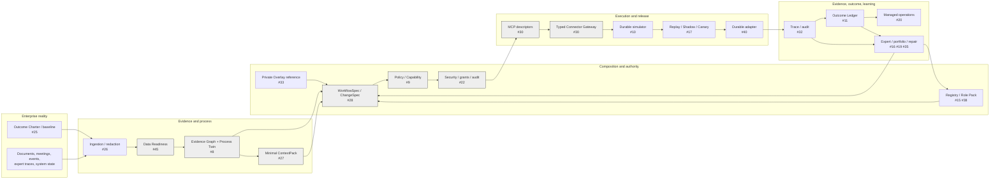

# FDE Agent Platform

A public, domain-neutral **Outcome Delivery OS** that converts enterprise evidence, reusable Role Packs, private Tenant Overlay references, policies, and outcome contracts into governed Digital Employee candidates.

The platform intentionally separates:

```text
evidence
→ design
→ authority
→ execution
→ verification
→ outcome
→ organizational adoption
→ productization
```

A successful model response, policy decision, security decision, tool call, or synthetic test can never silently become production or business truth.

## Current repository truth — 2026-08-17

Latest implementation terminal reviewed by this documentation pass:

```text
branch  agent/i30-d-connector-handoff
commit  b24444b7910197c20ff53d12c983a052c82738ab
tree    461dbe49fa15f732ddc2d3a7868a6a05ccc12a5c
state   OPEN DRAFT STACK · UNMERGED · INTEGRATION_ADMISSION_OPEN
```

| Plane | Actual repository state | Current evidence / next gate |
|---|---|---|
| Governance, public contracts, Role/Overlay compiler, skills-shared binding | `IMPLEMENTED_DRAFT` | PRs #5–#7, #24 |
| Agent operating map | implemented but stale before this reconciliation | PR #48, superseded for current-state routing by #94 |
| Registry / opportunity / ingestion / Eval base contracts / external claim ledger | `PARTIAL_CONTRACT` | PRs #49–#53; Gate #54 open |
| Data Readiness + Evidence Graph / Process Twin | `SYNTHETIC_CLOSED` | PRs #55–#63; Gate #64 open |
| ContextPack + Policy/Capability | `SYNTHETIC_CLOSED` | PRs #66–#73; Gate #75 open |
| WorkflowSpec / ChangeSpec | `SYNTHETIC_CLOSED` | PRs #77–#80; Gate #81 open |
| Security + typed Connector/MCP + in-memory synthetic ERP adapter | `SYNTHETIC_CLOSED` | PRs #83–#91; Gate #92 open |
| Durable execution, release/canary, Outcome Ledger, observability, Workbench, operations, capstone | `OPEN_DESIGN` | Issues #10–#12, #17–#21, #29–#44 |
| Git Town executable, linked Worktrees, local Forgejo, private Overlay, live identity/provider/canary | `BLOCKED_LIVE_SUBSTRATE` | Issues #13, #33, #40, #44, #46 |
| Merge, release, production, legal/financial settlement | `HUMAN_ADMIT_REQUIRED` | repository / organization authority |

No open Draft PR is treated as merged or admitted. No GitHub Actions run exists for the Stage B4 terminal. Git Town, Forgejo, live providers, customer outcomes, and production remain unexercised.

## Canonical procedural authority

Every unfinished Issue is directed by the immutable subject:

```text
ed3c/skills-shared@ec5a240fa3cbafda2c6a8bce0ae12143e0992f80
```

Canonical Skill bodies, system prompts, rubrics, scripts, and reference procedures remain in `skills-shared`. This repository stores only consumer bindings, task packets, product code/adapters, synthetic fixtures, tests, and exact-subject receipts.

Agent read order:

1. [`AGENTS.md`](AGENTS.md)
2. [`docs/governance/current-integration-status.md`](docs/governance/current-integration-status.md)
3. [`docs/architecture/closure-matrix.md`](docs/architecture/closure-matrix.md)
4. [`docs/architecture/README.md`](docs/architecture/README.md)
5. [`docs/governance/issue-dag.md`](docs/governance/issue-dag.md)
6. [`docs/governance/stack-index.md`](docs/governance/stack-index.md)
7. the owning Issue and nearest directory README

## What is actually closed

The repository has closed these problem classes **only on exact synthetic fixtures**:

- Role Pack + Tenant Overlay authority intersection.
- Data semantic/readiness fail-closed gating.
- bitemporal Process Twin with distinct documented/observed/system/approved views.
- contradiction-preserving minimal ContextPack assembly.
- deterministic Policy/Capability decisions with approval and separation of duties.
- static WorkflowSpec / ChangeSpec compilation with bounded retries, compensation, reconciliation, rollback, and model-authority limits.
- tenant/audience/workflow/operation-bound Security decisions and tamper-evident audit chain.
- typed Connector requests/results/receipts and descriptor-only MCP surface.
- in-memory idempotent draft-case side effects and timeout-after-commit reconciliation.

These remain open:

- durable workflow state across process restart;
- replay, Shadow, progressive canary, kill switch, and release promotion;
- persistent PostgreSQL tenancy and migrations;
- live identity, short-lived host grants, private Overlay resolution, and external connector providers;
- real engagement audit, FDE Workbench, organizational adoption, managed operations, and handoff;
- Outcome Ledger, causal attribution, ROI, unit economics, pricing, and settlement;
- model registry/routing/version release;
- expert behavior mining, learning, post-training, and reusable productization;
- full synthetic AP capstone and all live/customer evidence.

See the source-to-system verdicts in [`docs/architecture/closure-matrix.md`](docs/architecture/closure-matrix.md).

## End-to-end data flow



The grey nodes have synthetic Draft implementations. The remaining nodes are open Issues or live/private routes. Diagram color is orientation only; exact Issue/PR/Gate state is authoritative.

## Public / private split

```text
Public GitHub
  generic contracts and compilers
  provider-neutral policy/security/connector interfaces
  synthetic fixtures and adapters
  mutation/Eval harnesses
  redacted exact-subject receipts

Private local / Forgejo lane
  customer evidence and identities
  live Tenant Overlays and private policies
  system mappings and credential references
  commercial contracts and live receipts
  provider-specific private adapters where required
```

Public artifacts may bind an immutable private digest/reference. Private bodies never enter public Git, PR text, logs, fixtures, model context, or portable receipts.

## Global State Machines

### Evidence to design

```text
SOURCE_REGISTERED
→ PARSED / REDACTED
→ CLAIM_CANDIDATE
→ READINESS_CHECKED
→ ADMITTED / CONTRADICTED / DEGRADED / REJECTED
→ PROCESS_TWIN
→ CONTEXTPACK_READY / REFUSED
→ WORKFLOW_CANDIDATE
→ STATICALLY_COMPILED / REFUSED
```

Current synthetic implementation reaches `STATICALLY_COMPILED`; enterprise truth and Human process approval remain unproved.

### Authority to connector result

```text
POLICY_REQUESTED
→ DENY / APPROVAL_REQUIRED / ELIGIBLE_CANDIDATE
→ SECURITY_REQUESTED
→ DENY / ELIGIBLE_CANDIDATE
→ CONNECTOR_REQUEST_BOUND
→ SUCCEEDED
   / FAILED
   / RATE_LIMITED
   / PARTIAL
   / UNKNOWN_COMPLETION → RECONCILIATION_REQUIRED
```

Current implementation reaches these outcomes only through an in-memory synthetic adapter. `UNKNOWN_COMPLETION` never enters blind retry.

### Runtime and release — not implemented

```text
QUEUED
→ RUNNING
→ WAITING_HUMAN / SUCCEEDED / FAILED / TIMED_OUT
→ UNKNOWN_COMPLETION → RECONCILING
→ COMPENSATING / FROZEN / RECOVERED

CHANGE_REQUESTED
→ CHANGESPEC_CANDIDATE
→ REPLAY
→ SHADOW
→ RECOMMEND
→ DRAFT
→ REVERSIBLE_CANARY
→ APPROVED_COMMIT_CANDIDATE
→ MANAGED_PRODUCTION / ROLLED_BACK / FROZEN
```

Owned by #10 and #17. Natural-language input stops at an untrusted `ChangeSpec` candidate.

### Outcome and engagement — not implemented

```text
BASELINE_DRAFT
→ BASELINE_ADMITTED
→ MEASUREMENT_OPEN
→ ATTRIBUTION_REVIEW
→ VERIFIED_CANDIDATE / DISPUTED / UNDERPOWERED / REJECTED
→ HUMAN_SETTLEMENT / NO_SETTLEMENT
```

```text
MANDATE
→ TRIAGE_AND_BASELINE
→ EVIDENCE_AUDIT
→ PROCESS_TWIN_APPROVED
→ TARGET_DESIGNED
→ VERIFIED
→ SHADOW_AND_CANARY
→ MANAGED_OPERATION
→ OUTCOME_REVIEW
→ PRODUCTIZED / HANDOFF / TERMINATED
```

Owned by #11, #18, #20, #25, #36, and #42.

## Directory ownership, State Machines, and data flow

`EXISTS` means the directory is present on the Stage B4 terminal. It does not imply integrated admission.

| Path | Local State Machine | Consumes → emits | Issues / Gate | State |
|---|---|---|---|---|
| `.github/` | `TEMPLATE_DRAFT → CONTRACT_COMPLETE → ISSUE/PR_CREATED → HUMAN_REVIEW` | governance → work packets | #2 #14 #47 | `IMPLEMENTED_DRAFT` |
| `contracts/` | `PROPOSED → VALIDATED → LOCKED → SUPERSEDED` | architecture locks → public schemas | module Issues | `IMPLEMENTED_DRAFT` |
| `docs/` | `OBSERVED → RECONCILED → RECEIPTED → REBOUND` | Git/Issue/runtime facts → navigation/SSOT | #47 #94 | `IMPLEMENTED_DRAFT` |
| `fixtures/` | `RAW_SYNTHETIC → VALID/INVALID/EXPECTED → VERSIONED` | synthetic scenarios → oracles | module Issues | `IMPLEMENTED_DRAFT` |
| `scripts/` | `SUBJECT_BOUND → CHECKED → PASS/FAIL → RECEIPT` | exact subjects → deterministic evidence | module Issues | `IMPLEMENTED_DRAFT` |
| `src/compiler/` | `INPUT_BOUND → VALIDATED → NORMALIZED → COMPILED/REJECTED` | Role Pack + Overlay → DigitalEmployeeSpec | #4 | `IMPLEMENTED_DRAFT` |
| `src/registry/` | `DRAFT → VALIDATED → ACTIVE → SUPERSEDED/REVOKED` | artifact identities → RegistryEntry | #15 / #54 | `PARTIAL_CONTRACT` |
| `src/engagement/` | `SOURCE_BOUND → CLAIM_CANDIDATE → AMBIGUOUS/HUMAN_REVIEW` | source manifest → claims/entities | #26 / #54 | `PARTIAL_CONTRACT` |
| `src/data/` | `PROFILED → SEMANTICALLY_BOUND → READY/DEGRADED/BLOCKED` | source quality → readiness decision | #45 / #64 | `SYNTHETIC_CLOSED` |
| `src/evidence/` | `CLAIMS_BOUND → VIEWS_BUILT → CONTRADICTIONS_EXPOSED → TWIN/REFUSED` | admitted claims → Process Twin | #8 / #64 | `SYNTHETIC_CLOSED` |
| `src/context/` | `QUERY_BOUND → DEPENDENCIES_CLOSED → MINIMIZED → READY/REFUSED` | Process Twin → ContextPack | #27 / #75 | `SYNTHETIC_CLOSED` |
| `src/policy/` | `REQUESTED → DENY/APPROVAL_REQUIRED/ALLOW_CANDIDATE` | identity/action/capability → PolicyDecision | #9 / #75 | `SYNTHETIC_CLOSED` |
| `src/workflow/` | `DRAFT → VALIDATED → COMPILED/REFUSED` | Twin + Context + policy/capability → WorkflowSpec/ChangeSpec | #28 / #81 | `SYNTHETIC_CLOSED` |
| `src/security/` | `GRANT_BOUND → INVOCATION_EVALUATED → DENY/ALLOW_CANDIDATE → AUDIT_CHAINED` | policy/workflow/grant → SecurityDecision | #22 / #92 | `SYNTHETIC_CLOSED` |
| `src/connectors/` | `REQUEST_BOUND → SECURITY_VERIFIED → DISPATCHED → RESULT/RECONCILING` | exact request → result/receipt | #30 / #92 | `SYNTHETIC_CLOSED` |
| absent runtime/release/outcome/model/learning/observability/private/deployment/workbench/operations/assurance/API directories | Issue-specific future State Machines | implemented subjects → later receipts | #10–#12 #17–#21 #29 #32–#44 #46 | `OPEN_DESIGN` / `BLOCKED_LIVE_SUBSTRATE` |
| `evals/` | `CASE_BOUND → ORACLE_RUN → MUTATION_KILLED → RESULT` | exact subjects → EvalReceipt | #31 / #54 | `PARTIAL_CONTRACT` |
| `role-packs/` | `DRAFT → VALIDATED → BENCHMARKED → ACTIVE/SUPERSEDED` | reusable role primitives → RolePack versions | #38 | `ABSENT` |
| `test/` | `FIXTURE_BOUND → ASSERT → MUTATE → DETECT → REPORT` | code/fixtures → exact evidence | module Issues | `IMPLEMENTED_DRAFT` |

Detailed per-module mapping is in [`src/README.md`](src/README.md).

## Issue DAG and molecular Stacked PRs

Actual implementation is a DAG of exact subjects, not a fictional one-branch pipeline.

```text
Foundation #5 → #6 → #7 → #24 → #48

Contract siblings from #48:
  #49 Registry
  #50 Opportunity
  #51 Ingestion
  #52 Eval contracts
  #53 External evidence ledger

Stage B1:
  #51 → #55 → #56 → #57 → #59 → #60 → #61 → #62 → #63

Stage B2:
  Context #66 → #67 → #68
  Policy  #69 → #70 → #71
  exact convergence → #73

Stage B3:
  #73 → #77 → #78 → #79 → #80

Stage B4:
  #80 → #83 → #84 → #85 → #86 → #87 → #88 → #89 → #90 → #91
```

Atoms:

```text
C  contract/schema/interface lock
K  deterministic core
A  adapter/provider integration
E  Eval/mutation/fault controls
X  explicit convergence/E2E
D  documentation/receipt/handoff
```

See:

- [`docs/governance/stack-index.md`](docs/governance/stack-index.md) for every actual PR, exact terminal, missing atom, and next branch.
- [`docs/governance/issue-dag.md`](docs/governance/issue-dag.md) for hard-start, completion, integration, review, and live-substrate dependencies.
- [`docs/governance/current-integration-status.md`](docs/governance/current-integration-status.md) for Gate and evidence-lane state.

## Real-problem closure verdict

The architecture articles and PDFs identified real problems, but most are **not** end-to-end closed:

| Problem family | Verdict |
|---|---|
| Golden-path documents, semantic data quality, contradictions, bounded context | `PARTIAL_SYNTHETIC` to `CLOSED_SYNTHETIC` |
| Workflow authority, model limitations, idempotency, unknown completion, MCP trust boundary | `CLOSED_SYNTHETIC` |
| Durable execution, drift, replay, canary, rollback | `OPEN_DESIGN` |
| Live System-of-Record overlay and private tenant integration | `BLOCKED_LIVE_SUBSTRATE` |
| FDE organizational politics, Workbench, adoption, managed service | `OPEN_DESIGN` |
| Outcome/ROI, unit economics, commercial settlement | `SOURCE_REPORTED` + `OPEN_DESIGN` |
| 260-step flow, 10,000 expert actions, regional uplift, Varick SFT/RL | `SOURCE_REPORTED` / `SYNTHETIC_ANALOG_ONLY` |
| Git Town + Dual Forge runtime | `BLOCKED_LIVE_SUBSTRATE` |

Full matrix: [`docs/architecture/closure-matrix.md`](docs/architecture/closure-matrix.md).

## Next critical path

After Gate #92 is admitted:

```text
I31-K/E/D  complete executable Eval plane
→ I10-C/K/E/D  deterministic durable simulator and Runtime Receipts
→ I17-C/K/E/X/D  replay, Shadow, risk-weighted canary, kill switch, rollback
→ I11-C/K/E/D  Outcome Ledger and unit economics
→ I18 / I42  Human Workbench and engagement phase gates
→ I21-C/K/A/E/X/D  full synthetic AP invoice/PO exception capstone
```

Parallel productization and real-substrate paths:

```text
I15-K/E/D Registry
I25-K/E/D Discovery / baseline
I26-K/E/D Ingestion
I29-C/K/A/E/D PostgreSQL
I32-C/K/A/E/D Observability
#13 → #33 → #44 → #46 private/live connector admission
```

## Verification boundary

Current documentation review can verify GitHub Issues, PRs, branches, trees, files, and consistency. It does not execute the full repository locally.

The strongest existing stage-scoped synthetic reports are:

```text
Stage B1  Data/Process         reported green on exact local snapshots
Stage B2  Context/Policy       reported green on exact local snapshots
Stage B3  Workflow             16/16
Stage B4  Security/Connector   30/30
```

These remain exact-tree local evidence, not GitHub Actions, merge, live provider, production, or ROI.

For a local-capable admitted convergence tree:

```bash
npm test
npm run check
npm run compile:demo
```

Then record Git Town, Forgejo, Actions, publication, merge, release, production, and outcome as separate receipts.
