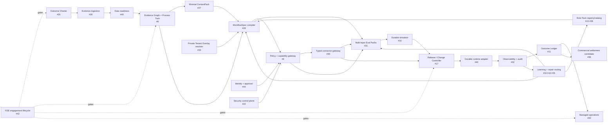

# FDE Agent Platform

A public, domain-neutral **Outcome Delivery OS** that converts reusable Role Packs and private Tenant Overlay references into governed Digital Employees. The platform separates evidence, authority, execution, outcome, and publication so that a successful model response or tool call can never silently become production truth.

## Current repository truth

| Subject | Current state | Evidence ceiling |
|---|---|---|
| Repository governance and Shadow Architecture | Implemented in draft Stack PR #5 | L2 deterministic checks |
| Public contracts and synthetic fixtures | Implemented in draft Stack PR #6 | L2 deterministic checks |
| Role Pack + Tenant Overlay compiler | Implemented in draft Stack PR #7 | L2 deterministic checks |
| Exact external `skills-shared` binding and no-vendoring controls | Implemented in draft Stack PR #24 | L2 deterministic checks |
| Agent operating map and complete Stack-PR index | Implementing in Draft PR #48 on `agent/04-agent-operating-map` | Static GitHub/readback evidence |
| Git Town executable, linked worktrees, local Forgejo, exact-head Actions | `ABSENT` / `NOT_EXERCISED` | Owned by #13 |
| Real connectors, durable provider, enterprise identity, production traffic, ROI | `NOT_IMPLEMENTED` / `NOT_EXERCISED` | Separate issues and Human admission |

A planned issue, directory, branch, or PR atom is always labeled `PLANNED`. It is not evidence that code, a Worktree, a provider, or a runtime exists.

## Canonical procedural authority

Every unfinished issue references procedures from the immutable subject:

```text
ed3c/skills-shared@ec5a240fa3cbafda2c6a8bce0ae12143e0992f80
```

Canonical Skill bodies, shared system prompts, reference procedures, scripts, schemas, and architecture rubrics remain in `skills-shared`. This repository stores only consumer-owned bindings, profiles, task packets, product code, adapters, synthetic fixtures, tests, and exact-subject receipts.

Start with:

1. [`AGENTS.md`](AGENTS.md)
2. [`docs/governance/skills-shared-binding.json`](docs/governance/skills-shared-binding.json)
3. [`docs/architecture/README.md`](docs/architecture/README.md)
4. [`docs/governance/issue-dag.md`](docs/governance/issue-dag.md)
5. [`docs/governance/stack-index.md`](docs/governance/stack-index.md)
6. the owning Issue and the nearest directory `README.md`

## End-to-end data flow



### Public/private split

```text
Public GitHub
  generic contracts, Role Packs, compilers, policy skeletons,
  synthetic fixtures, Eval harnesses, redacted receipts

Private local/Forgejo lane
  customer evidence, identities, live Tenant Overlays, private policies,
  system mappings, credential references, commercial contracts, live receipts
```

Private bytes never cross into public GitHub. Public artifacts may bind an immutable private digest/reference, never the private body.

## Global state machines

### Digital Employee artifact

```text
DRAFT
→ VALIDATED
→ COMPILED
→ EVALUATED
→ SHADOWED
→ REVERSIBLE_CANARY
→ MANAGED_PRODUCTION
├─ DEGRADED → FROZEN → HUMAN_TAKEOVER → RECOVERED
└─ ROLLED_BACK / RETIRED
```

Only `DRAFT → VALIDATED → COMPILED` exists today. Later states are issue-owned and Human-admitted.

### Evidence

```text
SOURCE_REGISTERED
→ PARSED
→ REDACTED
→ CLAIM_CANDIDATE
→ DISAMBIGUATED
→ READINESS_CHECKED
├─ ADMITTED
├─ CONTRADICTED
├─ STALE
├─ DEGRADED
└─ REJECTED
```

### Change and release

```text
CHANGE_REQUESTED
→ CHANGESPEC_CANDIDATE
→ VALIDATED
→ REPLAY
→ SHADOW
→ RECOMMEND
→ DRAFT
→ REVERSIBLE_CANARY
→ APPROVED_COMMIT_CANDIDATE
→ MANAGED_PRODUCTION
├─ FROZEN
├─ REJECTED
└─ ROLLED_BACK
```

Natural-language input stops at `CHANGESPEC_CANDIDATE`; it never executes directly.

### Engagement

```text
MANDATE
→ TRIAGE_AND_BASELINE
→ EVIDENCE_AUDIT
→ PROCESS_TWIN_APPROVED
→ TARGET_DESIGNED
→ VERIFIED
→ SHADOW_AND_CANARY
→ MANAGED_OPERATION
→ OUTCOME_REVIEW
→ PRODUCTIZED / HANDOFF / TERMINATED
```

The complete gate contract is tracked by #42.

## Directory ownership, local state, and data flow

`IMPLEMENTED` means the directory exists on the current branch. `PLANNED` means the path is reserved by an Issue and must not be invented before that Issue compiles its task contract.

| Path | Local state machine | Consumes → emits | Owning issues | State |
|---|---|---|---|---|
| `.github/` | `TEMPLATE_DRAFT → CONTRACT_COMPLETE → ISSUE/PR_CREATED → HUMAN_REVIEW` | governance policy → work packet / PR envelope | #2 #14 #47 | IMPLEMENTED |
| `contracts/` | `PROPOSED → SCHEMA_VALIDATED → LOCKED → SUPERSEDED` | architecture locks → versioned public schemas | #3 #15 #28 #31 | IMPLEMENTED |
| `docs/architecture/` | `OBSERVED → MODELLED → REVIEWED → RECONCILED` | runtime/issue facts → architecture SSOT + Shadow deltas | #2 #14 #47 | IMPLEMENTED |
| `docs/governance/` | `BOUND → CHECKED → RECEIPTED → REBOUND` | shared subject + Git/Issue state → bindings / DAG / Stack index | #2 #13 #14 #47 | IMPLEMENTED |
| `fixtures/` | `RAW_SYNTHETIC → VALID/INVALID/EXPECTED → VERSIONED → CONSUMED` | synthetic cases → deterministic oracle inputs | #3 #4 #31 | IMPLEMENTED |
| `scripts/` | `INPUT_BOUND → CHECKED → PASS/FAIL → RECEIPT` | repository subjects → deterministic gate result | #2 #3 #14 #31 | IMPLEMENTED |
| `src/compiler/` | `INPUT_BOUND → CROSS_VALIDATED → NORMALIZED → COMPILED/REJECTED` | Role Pack + Overlay → `DigitalEmployeeSpec` | #4 | IMPLEMENTED |
| `test/` | `FIXTURE_BOUND → ASSERT → MUTATE → DETECT → REPORT` | code + fixtures → exact test evidence | #2 #3 #4 #14 #31 | IMPLEMENTED |
| `src/discovery/` | `CANDIDATE → SCORED → BASELINED → PILOT_PLANNED/REJECTED` | opportunity evidence → Outcome Charter / pilot plan | #25 | PLANNED |
| `src/engagement/` | `MANDATE → AUDIT → DESIGN → PILOT → MANAGED/HANDOFF` | source access + owners → engagement receipts | #26 #42 | PLANNED |
| `src/data/` | `PROFILED → SEMANTICALLY_BOUND → READY/DEGRADED/BLOCKED` | source data → readiness + lineage | #45 #29 | PLANNED |
| `src/evidence/` | `CLAIM_CANDIDATE → VERSIONED → ADMITTED/CONTRADICTED/STALE` | ingestion/readiness → Evidence Graph / Process Twin | #8 | PLANNED |
| `src/context/` | `QUERY_BOUND → RETRIEVED → MINIMIZED → CONTEXTPACK/REFUSED` | evidence/policy scope → `ContextPack` | #27 | PLANNED |
| `src/registry/` | `REGISTERED → VALIDATED → ACTIVE → SUPERSEDED/REVOKED` | versioned artifacts → immutable registry subjects | #15 | PLANNED |
| `src/workflow/` | `CANDIDATE → STATIC_VALIDATION → COMPILED/REFUSED` | Twin + Context + Role/Overlay + policy → WorkflowSpec/ChangeSpec | #28 | PLANNED |
| `src/policy/` | `REQUESTED → AUTHENTICATED → AUTHORIZED/DENIED/APPROVAL_REQUIRED` | identity + action + policy → decision receipt | #9 | PLANNED |
| `src/security/` | `THREAT_IDENTIFIED → CONTROL_BOUND → TESTED → ADMITTED/BLOCKED` | trust boundary → security policy/evidence | #22 | PLANNED |
| `src/identity/` | `IDENTIFIED → ROLE_RESOLVED → APPROVAL_BOUND → EXPIRED/REVOKED` | SSO/directory → identity and approval subjects | #44 | PLANNED |
| `src/connectors/` | `DISCOVERED → CAPABILITY_BOUND → INVOKED → OBSERVED/RECONCILING` | policy-approved operation → typed system result | #30 | PLANNED |
| `src/runtime/` | `QUEUED → RUNNING/WAITING → SUCCEEDED/FAILED/UNKNOWN → RECONCILED` | admitted WorkflowSpec → Runtime Receipts | #10 #40 | PLANNED |
| `src/release/` | `REPLAY → SHADOW → DRAFT → CANARY → PROMOTION_CANDIDATE/ROLLBACK` | Eval + approvals + runtime → release receipt | #17 | PLANNED |
| `src/outcomes/` | `BASELINE → MEASUREMENT → ATTRIBUTION_REVIEW → VERIFIED_CANDIDATE/DISPUTED` | runtime + business sources → Outcome Ledger/settlement candidate | #11 #36 | PLANNED |
| `src/models/` | `REGISTERED → OFFLINE_EVAL → SHADOW → CANARY → ACTIVE/ROLLBACK` | task/privacy/cost policy → routed model subject | #12 | PLANNED |
| `src/learning/` | `TRACE_SELECTED → ADJUDICATED → REPAIR_CANDIDATE → EVALUATED → ADMITTED/REJECTED` | incidents/outcomes → candidate reusable assets | #16 #19 #35 | PLANNED |
| `src/observability/` | `SPAN_OPEN → CORRELATED → REDACTED → SEALED/INCOMPLETE` | all exact subjects → trace/audit/outcome links | #32 | PLANNED |
| `src/private-lane/` | `REFERENCE_BOUND → RESOLVED → DIGEST_VERIFIED → USED/REVOKED` | private digest reference → in-memory tenant subject | #33 | PLANNED |
| `src/deployment/` | `PROFILED → VALIDATED → STAGED → CANARY → ADMITTED/ROLLED_BACK` | runtime/security/provider facts → deployment manifest | #34 #41 #46 | PLANNED |
| `src/workbench/` | `REVIEW_REQUIRED → HUMAN_DECISION → SIGNED/REJECTED/EXPIRED` | contradictions/approvals/outcomes → decision receipts | #18 #37 | PLANNED |
| `src/operations/` | `ONBOARDING → MANAGED → DEGRADED/FROZEN → RECOVERED/HANDOFF` | runtime incidents + SLO → managed-service state | #20 | PLANNED |
| `src/assurance/` | `CONTROL_MAPPED → EVIDENCE_BOUND → REVIEWED → GAP/READY_FOR_EXTERNAL_REVIEW` | controls + receipts → evidence pack | #43 | PLANNED |
| `src/api/` | `REQUEST → VALIDATE → READ/COMPILE/PROPOSE → RECEIPT` | typed client request → bounded platform response | #39 | PLANNED |
| `role-packs/` | `DRAFT → VALIDATED → BENCHMARKED → ACTIVE/SUPERSEDED` | reusable role primitives → Role Pack versions | #38 | PLANNED |
| `evals/` | `CASE_BOUND → ORACLE_RUN → MUTATION_KILLED → PASS/FAIL/NOT_EXERCISED` | exact subjects + fixtures → Eval receipts | #31 | PLANNED |

Detailed architecture and direct issue dependencies are in [`docs/architecture/README.md`](docs/architecture/README.md) and [`docs/governance/issue-dag.md`](docs/governance/issue-dag.md).

## Issue DAG and Git Town Stacked PRs

The active serial governance stack is:

```text
main
└─ agent/00-bootstrap-control-plane        #2  / PR #5
   └─ agent/01-contracts                   #3  / PR #6
      └─ agent/02-role-overlay-compiler    #4  / PR #7
         └─ agent/03-shared-procedure-bindings #14 / PR #24
            └─ agent/04-agent-operating-map    #47 / DRAFT PR #48
```

After this documentation gate, implementation is a **DAG**, not one artificial 40-branch chain:

- true contract/implementation dependencies form serial child PRs;
- path-disjoint implementations form sibling stacks;
- review/evidence work uses read-only lanes;
- live/private work remains in the Dual Forge lane;
- convergence branches consume exact admitted parent subjects.

Every planned Issue is decomposed into molecular terminal PR atoms:

```text
C  contract/schema/interface lock
K  deterministic core
A  adapter/provider integration
E  evals, mutation, fault injection
X  cross-module integration/E2E
D  documentation, receipt, handoff
```

The complete issue-to-atom and parent graph is maintained in [`docs/governance/stack-index.md`](docs/governance/stack-index.md). An atom is not created until its task packet has an immutable base, objective/non-goals, path lease, interface locks, acceptance commands, negative controls, evidence ceiling, cleanup, and rollback subject.

## Agent workflow

```text
READ AGENTS
→ BIND ISSUE + EXACT skills-shared SUBJECT
→ READ NEAREST README
→ LOCK INTERFACES
→ COMPILE ISSUE DAG / PR ATOMS
→ ACQUIRE ONE PATH LEASE
→ IMPLEMENT SMALLEST COHESIVE ATOM
→ RUN IMMUTABLE + MUTATION GATES
→ SHADOW ARCHITECTURE REVIEW
→ OPEN/UPDATE CHILD OR SIBLING DRAFT PR
→ REPORT EXACT EVIDENCE + BLINDSPOTS
→ HUMAN ADMIT
```

## Verification

Node.js 22 or newer is required for the current bootstrap slice.

```bash
npm test
npm run check
npm run compile:demo
```

A green local run proves only the exact local tree. Git Town synchronization, Forgejo delivery, GitHub Actions, merge, release, production operation, commercial settlement, and business outcomes remain separate evidence lanes.
