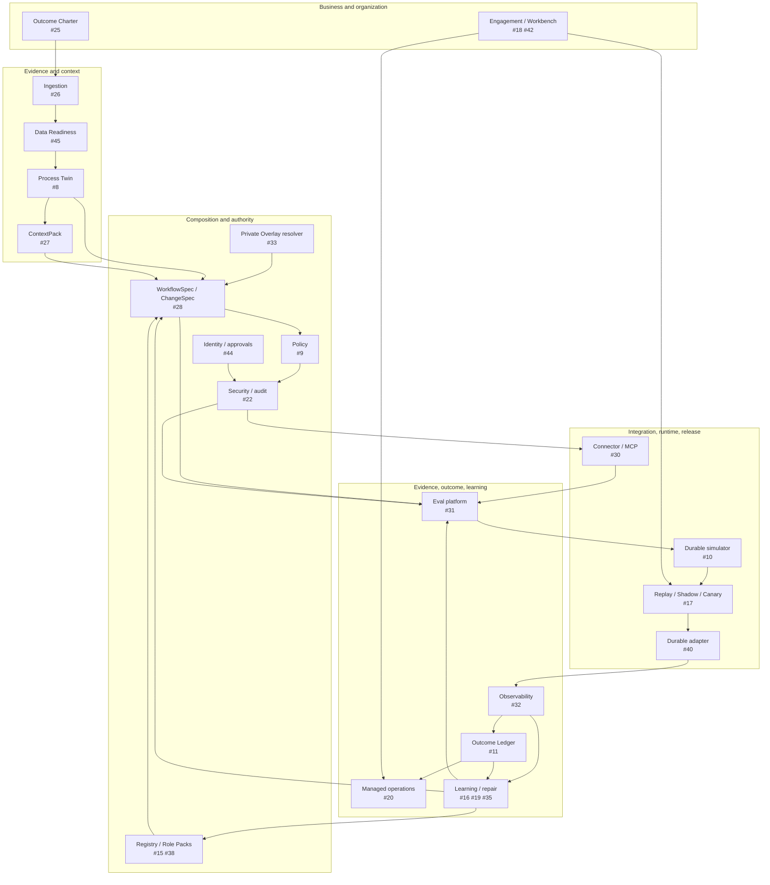
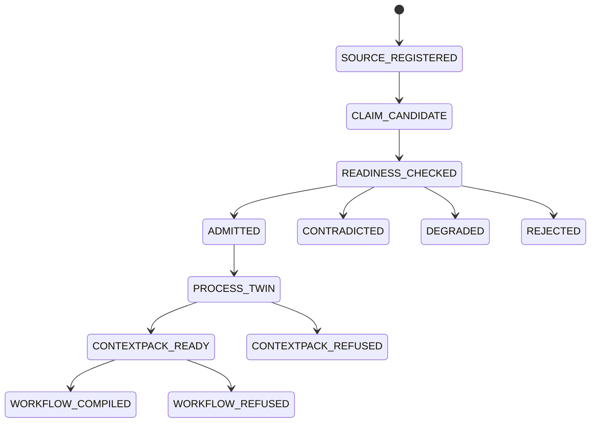
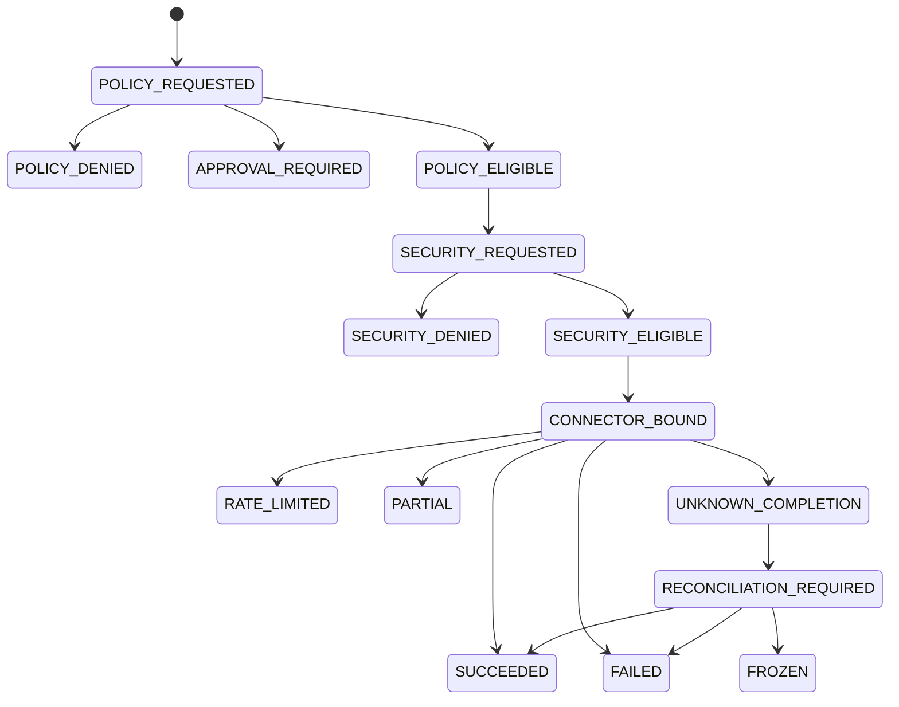
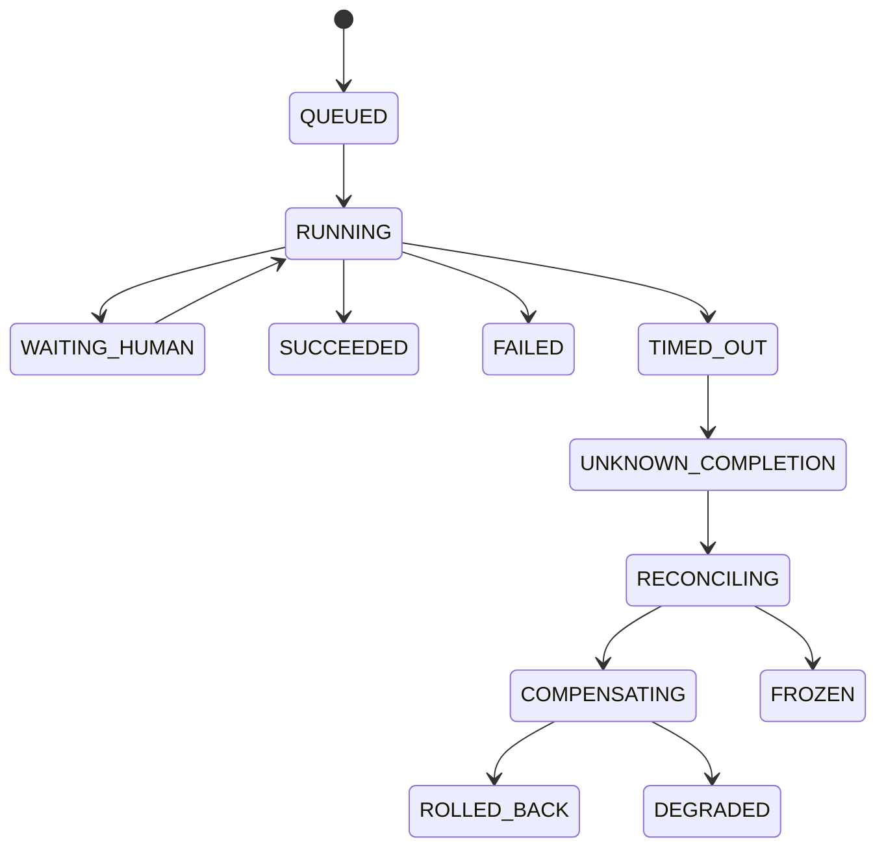

# Architecture SSOT

## Purpose

This document owns the architecture model for `fde-agent-platform`. Root `README.md` is the orientation surface; Open Issues own unfinished contracts; exact Git objects and runtime receipts own observed facts.

The system compiles enterprise evidence into governed execution candidates, but only a complete evidence-to-outcome loop may be called an FDE delivery closure.

## Classification and current gate

- Spatial complexity: **Level C — distributed / agentic system**.
- Shadow Architecture mode: **MONITOR**.
- Current exact implementation terminal: `agent/i30-d-connector-handoff@b24444b7910197c20ff53d12c983a052c82738ab`.
- Current gate: **SYNTHETIC CONTROL PLANE THROUGH CONNECTOR BOUNDARY**.
- Current admission state: **open Draft Stacks; Gates #54, #64, #75, #81, and #92 remain open**.
- Current external-effect scope: an in-memory synthetic ERP adapter only.
- PRECHECK is mandatory before persistence, concurrency, network/provider access, credentials, private data, permission widening, external writes, release, production, or destructive rollback.

## Architecture planes and closure state

| Plane | Responsibility | Issues | Current state | Authority |
|---|---|---:|---|---|
| Governance / delivery | procedures, Issue DAG, Stack evidence, public/private boundary | #2 #13 #14 #47 #94 | `IMPLEMENTED_DRAFT`; live Git Town/Forgejo absent | branch/receipt candidates only |
| Business / engagement | triage, baseline, phase gates, Human owners | #25 #42 #18 #37 | contract fragment only / open | Human-owned business decision |
| Evidence / data | ingestion, readiness, bitemporal graph, context, persistence | #26 #45 #8 #27 #29 | readiness/Twin/context synthetic; ingestion core/persistence open | evidence admission only |
| Product composition | Registry, Role Pack, private Overlay, DigitalEmployee | #3 #4 #15 #33 #38 | compiler draft; Registry contract only | versioned candidates |
| Workflow / authority | WorkflowSpec, ChangeSpec, Policy, Security, Identity | #28 #9 #22 #44 | workflow/policy/security synthetic; live identity open | allow/deny/approval candidate |
| Connector / MCP | typed capabilities, exact requests/results, reconciliation | #30 | synthetic in-memory closure | exact synthetic action only |
| Runtime / release | durable execution, receipts, replay, Shadow, canary, rollback | #10 #17 #40 #41 | `OPEN_DESIGN` | none yet |
| Eval / observability | common Evals, traces, audit, assurance | #31 #32 #43 | Eval contract only; module mutations exist | evidence, never certification |
| Outcome / operations | attribution, unit economics, managed service, pricing | #11 #20 #36 | `OPEN_DESIGN` | Human/legal settlement |
| Models / learning | routing, versioning, expert traces, productization, repair | #12 #16 #19 #35 | `OPEN_DESIGN` | candidate improvement only |
| Product surfaces | API, Workbench, capstone, live canary | #39 #18 #21 #46 | `OPEN_DESIGN` / live blocked | surface only; cannot widen authority |
| Deployment / private lane | environment profiles, private references, resilience | #13 #33 #34 #41 #44 #46 | `BLOCKED_LIVE_SUBSTRATE` | exact-environment Human admission |

## Component DAG



Existing synthetic implementation stops at `G`. `SIM` and every downstream runtime/outcome/organization loop remain open.

## Canonical subjects

| Subject | Current implementation | Identity requirement | May authorize? |
|---|---|---|---|
| `OutcomeCharter` / `BoundedValuePilot` | contract only, PR #50 | baseline, owner, window, counterfactual, digest | no |
| `SourceManifest` / claim candidate | contract only, PR #51 | tenant, source/parser/redaction digest | no |
| `DataReadinessDecision` | synthetic C/K/E, PRs #55–#57 | metric/profile/task/input digests | no; may block |
| `EvidenceClaim` / `ProcessTwin` | synthetic C/K/E/D, PRs #60–#63 | provenance, bitemporal view, self digest | no |
| `ContextPack` | synthetic C/K/E, PRs #66–#68 | exact Twin/query/evidence/policy/digest | no |
| `RegistryEntry` | contract only, PR #49 | logical ID, version, digest, receipt | no |
| `DigitalEmployeeSpec` | deterministic compiler, PR #7 | Role/Overlay digests, effective authority | candidate only |
| `PolicyDecision` | synthetic C/K/E, PRs #69–#71 | request/capability/digest/expiry | eligible candidate only |
| `WorkflowSpec` / `ChangeSpec` | synthetic C/K/E/D, PRs #77–#80 | exact inputs, transitions, policies, Evals, digest | no execution authority |
| `CapabilityGrant` / `ToolSecurityDecision` | synthetic C/K/E/D, PRs #83–#86 | tenant/principal/audience/workflow/operation/expiry/digest | eligible candidate only |
| `ConnectorRequest/Result/Receipt` | synthetic C/K/A/E/D, PRs #87–#91 | workflow/security/capability/endpoint/input/operation/version/digest | synthetic adapter only |
| `EvalReceipt` | base contract only, PR #52 | subject, oracle, fixture, environment, mutation | release input only |
| `RuntimeReceipt` | bootstrap schema only; executable runtime absent | workflow/run/operation/state subjects | evidence only |
| `OutcomeRecord` | absent | baseline, measurement, costs, attribution | settlement candidate |
| `EngagementReceipt` | absent | phase, owner, deliverables, decision | gate evidence |

## State Machines

### Implemented synthetic evidence/design path



The repository implements the deterministic synthetic mechanics, not real enterprise source acquisition or Process Owner acceptance.

### Implemented synthetic authority/connector path



`POLICY_ELIGIBLE` and `SECURITY_ELIGIBLE` are not execution admission outside the exact synthetic gateway.

### Runtime / release path — open



Owned by #10/#40. Current connector reconciliation is a narrow adapter primitive, not a durable orchestration engine.

```text
CHANGE_REQUESTED
→ CHANGESPEC_CANDIDATE
→ REPLAY
→ SHADOW
→ RECOMMEND
→ DRAFT
→ REVERSIBLE_CANARY
→ APPROVED_COMMIT_CANDIDATE
→ MANAGED_PRODUCTION / ROLLED_BACK / FROZEN
```

Owned by #17. No release progression exists today.

### Outcome / improvement path — open

```text
BASELINE_DRAFT
→ BASELINE_ADMITTED
→ MEASUREMENT_OPEN
→ MEASURED
→ ATTRIBUTION_REVIEW
→ VERIFIED_CANDIDATE / DISPUTED / UNDERPOWERED / CONTAMINATED / REJECTED
→ HUMAN_SETTLEMENT / NO_SETTLEMENT
```

```text
TRACE_SELECTED
→ PII_SCRUBBED
→ HUMAN_ADJUDICATED
→ FAILURE_CLASSIFIED
→ REPAIR_CANDIDATE
→ OFFLINE_EVALUATED
→ SHADOW / CANARY
→ ADMITTED / REJECTED
```

Owned by #11/#16/#19/#35. No source article, synthetic fixture, or model output may skip these states.

## Authority matrix

| Decision | Deterministic system | Model | Human / external authority |
|---|---|---|---|
| schema / digest / transition legality | owns | may explain | reviews contract changes |
| evidence extraction | validates provenance/shape | may propose | resolves ambiguity and truth conflicts |
| workflow candidate | compiles and refuses | may propose bounded content | approves target process |
| authorization | Policy/Security own deterministic evaluation | no authority | owns exact approvals/waivers |
| connector operation | exact Gateway enforces subjects | no endpoint/grant selection | admits restricted/live operations |
| retry / reconciliation | deterministic state/operation identity | no authority | handles unsupported ambiguity |
| release progression | absent; #17 owns future gates | no authority | admits canary/promotion/rollback |
| merge / publication | repository evidence only | no authority | repository policy |
| outcome / settlement | absent; #11 calculates future candidate | no authority | finance/legal/customer |
| production | prerequisites only | no authority | organization owner |

## Closure definition

A real FDE problem is closed only when all relevant layers are evidenced:

```text
authorized source
+ truthful/ready data
+ approved process/context
+ governed workflow/authority
+ durable and reversible execution
+ progressive release
+ observed state and outcome
+ organizational ownership
+ reusable product asset
```

The detailed real-problem matrix is [`closure-matrix.md`](closure-matrix.md). Current repository-wide verdict:

```text
Synthetic control-plane subloops: partly closed
Durable execution loop: open
Release loop: open
Business outcome loop: open
Organizational adoption loop: open
Live/private provider loop: blocked
External source claims: not independently reproduced
```

## Golden invariants

| ID | Statement | Current enforcement | Falsifier |
|---|---|---|---|
| INV-001 | Tenant Overlay cannot widen Role Pack authority. | contracts/compiler mutations | undeclared action reaches output |
| INV-002 | Private/secret tenant material never enters public GitHub. | governance/no-vendoring/content checks | private bytes in Git/PR/log/fixture |
| INV-003 | Prohibited actions survive all lifecycle states. | compiler/policy/workflow/security | prohibited action becomes eligible |
| INV-004 | Every candidate/receipt binds exact input identity. | canonical digests | subject absent or altered |
| INV-005 | Evidence is not authority. | typed Process/Context/Policy boundaries | document/model/trace authorizes action |
| INV-006 | Human-owned boundaries remain Human-owned. | approval and production-admission fields | high-risk transition lacks Human subject |
| INV-007 | Unknown completion reconciles before retry. | workflow/connector mutations | duplicate effect after timeout |
| INV-008 | Verification lanes remain distinct. | evidence vocabulary / Gate Issues | local green reported as Actions/production/ROI |
| INV-009 | Shared Skills remain external. | exact binding / no-vendoring | consumer Skill body appears |
| INV-010 | Parallel writers are path-disjoint. | Work Pack / Stack rules | two writers own one path |
| INV-011 | A verifier proves sensitivity. | planted mutations | broken assertion still passes |
| INV-012 | Business success requires measured outcome. | future #11/#25 contracts | tool success counted as ROI |
| INV-013 | MCP is descriptor-only. | MCP contract / connector mutations | endpoint/grant/callback enters descriptor |
| INV-014 | Source claims do not become runtime facts. | #23 evidence ledger / closure matrix | interview claim marked reproduced |

## Unknown and blocker register

| Boundary | Current state | Owning route |
|---|---|---|
| reviewed integrated convergence through Stage B4 | `INTEGRATION_ADMISSION_OPEN` | Gates #54 #64 #75 #81 #92 |
| Git Town executable, restack, linked Worktrees | `NOT_EXERCISED` / `ABSENT` | #13 |
| local Forgejo / private dual-forge lane | `ABSENT` | #13 #33 |
| executable common Eval plane | `PARTIAL_CONTRACT` | #31 |
| durable simulator / provider | `NOT_IMPLEMENTED` | #10 #40 |
| replay / Shadow / canary / rollback | `NOT_IMPLEMENTED` | #17 |
| PostgreSQL persistence / tenancy / restore | `NOT_IMPLEMENTED` | #29 |
| enterprise IdP / approval lifecycle | `NOT_IMPLEMENTED` | #44 |
| live provider connector and private mappings | `NOT_EXERCISED` | #33 #46 |
| observability / trace linkage | `NOT_IMPLEMENTED` | #32 |
| Outcome Ledger / unit economics / ROI | `NOT_IMPLEMENTED` | #11 #25 #36 |
| FDE Workbench / organization adoption / operations | `NOT_IMPLEMENTED` | #18 #20 #37 #42 |
| model routing / version release | `NOT_IMPLEMENTED` | #12 |
| expert behavior / learning / post-training | `NOT_IMPLEMENTED` | #16 #19 #35 |
| external case evidence | source-reported / synthetic analogue | #23 |
| exact-head GitHub Actions | `NOT_EXERCISED` | repository CI lane |
| merge / release / production | `HUMAN_ADMIT_REQUIRED` | repository / organization |

## Evidence ladder

- **L0** — source statement or design intent.
- **L1** — static architecture and provider readback.
- **L2** — deterministic unit/contract/mutation evidence.
- **L3** — reviewed local cross-module integration.
- **L4** — authorized local/containerized/private sandbox.
- **L5+** — staging/production/adversarial/operational evidence for the exact environment.

Evidence never transfers automatically across commit, configuration, model, connector, policy, tenant, environment, or time-window changes.
