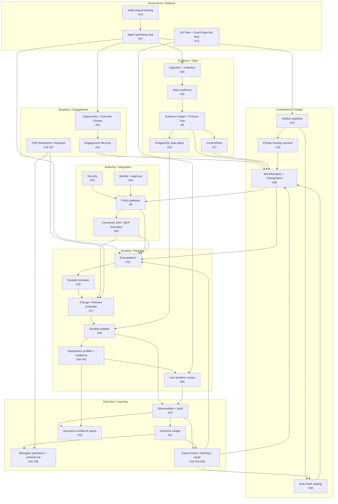
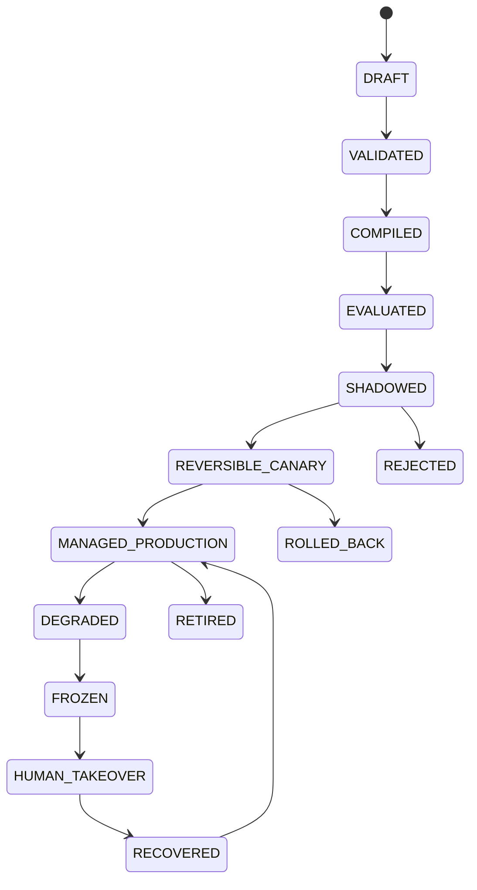
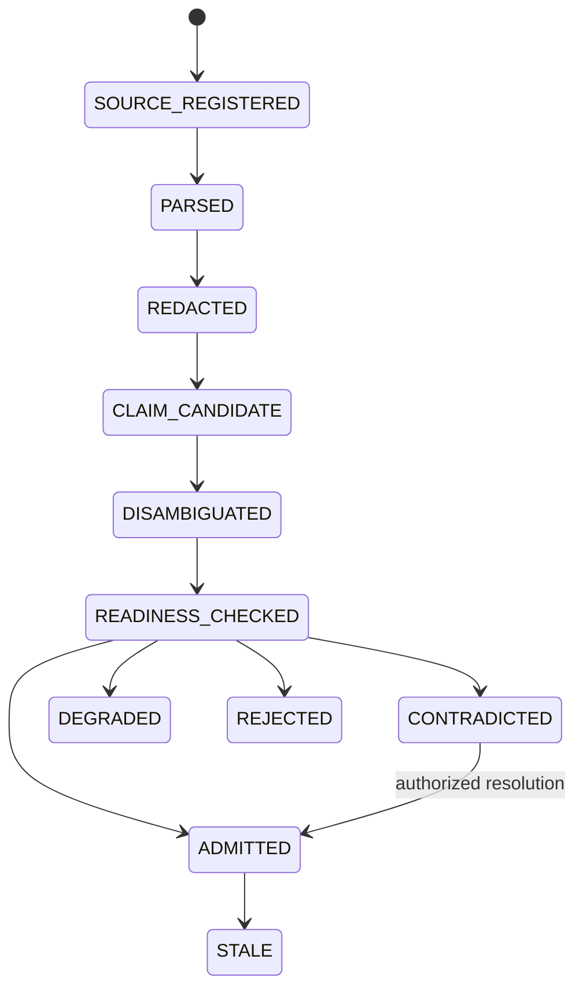
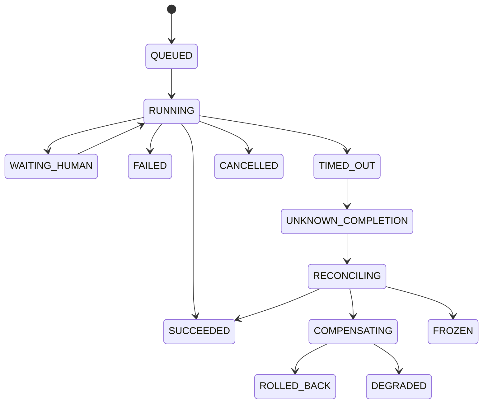

# Architecture SSOT

## Purpose

This document owns the architecture model for `fde-agent-platform`. Root `README.md` is the orientation surface; this file is the system-design authority. Open Issues own unfinished implementation contracts. Runtime receipts own execution facts.

The platform converts enterprise intent and evidence into bounded Digital Employee candidates, then admits execution only through deterministic policy, Evals, progressive authority, durable runtime, Human governance, and measurable outcomes.

## Classification and operating mode

- Spatial complexity: **Level C — distributed / agentic system**.
- Shadow Architecture mode: **MONITOR**.
- Current implementation gate: **READY_FOR_PROTOTYPE**.
- Current executable scope: public contracts plus deterministic Role Pack/Overlay compilation.
- PRECHECK is mandatory before persistence, concurrency, network/provider access, credentials, permission widening, external writes, production publication, or destructive rollback.

## Architecture planes

| Plane | Responsibility | Canonical issues | Authority |
|---|---|---|---|
| Governance and delivery | shared-procedure binding, task DAG, Git/forge/Stack evidence | #2 #13 #14 #47 | candidate branches and receipts only |
| Business and engagement | opportunity, baseline, Outcome Charter, phase gates, Human owners | #25 #42 #18 #37 | Human-owned business decisions |
| Evidence and data | ingestion, redaction, semantics, readiness, bitemporal graph, context | #26 #45 #8 #27 #29 | evidence admission, never execution authority |
| Product composition | registries, Role Packs, private overlay reference, compiler | #3 #4 #15 #33 #38 | produce versioned candidates |
| Workflow and authority | WorkflowSpec/ChangeSpec, policy, security, identity | #28 #9 #22 #44 | deterministic allow/deny/approval-required |
| Integration and execution | connector gateway, simulator, durable adapter, reconciliation | #30 #10 #40 | bounded action under policy/approval |
| Verification and release | Eval Packs, replay, Shadow, canary, rollback | #31 #17 #41 | promotion candidate only |
| Observability and assurance | trace/audit/outcome linkage, evidence packs | #32 #43 | evidence generation, not certification |
| Outcome and operations | attribution, unit economics, managed service, pricing | #11 #20 #36 | settlement remains Human/legal owned |
| Models and learning | routing/versioning, expert traces, productization, repair/post-training | #12 #16 #19 #35 | candidate improvement only |
| Product surfaces | developer API/SDK/CLI, Workbench, capstone, live canary | #39 #18 #21 #46 | surface existing authority, never widen it |
| Deployment | environment profiles, private lane, resilience | #34 #33 #41 #46 | exact-environment admission only |

## Component DAG



The diagram shows logical dependencies. Git branches are resolved through the Stack/Issue task contract; a node with several prerequisites receives an explicit convergence branch after exact parent subjects are admitted.

## Canonical data subjects

| Subject | Source | Required identity | May authorize? |
|---|---|---|---|
| `OutcomeCharter` | #25 / Human owners | version, baseline source, window, owner, digest | No; defines goals/gates |
| `SourceManifest` | #26 | tenant/reference, source digest, parser version | No |
| `DataReadinessReceipt` | #45 | task, fields/metrics, source versions, result | No; may block/degrade |
| `EvidenceClaim` / Process Twin node | #8 | provenance, valid/recorded time, confidence/status | No |
| `ContextPack` | #27 | exact evidence set, omissions, contradictions, budget | No |
| `RolePack` | #15/#38 | version/digest, capability ceiling | No |
| private `TenantOverlay` reference | #15/#33 | tenant, immutable version/digest, resolver disposition | No |
| `DigitalEmployeeSpec` | #4 | exact inputs/contracts, effective authority | Candidate only |
| `WorkflowSpec` / `ChangeSpec` | #28 | exact dependencies, actions, states, approvals, rollback | Candidate only |
| `PolicyDecision` | #9/#22/#44 | subject, tenant, action, policy, identity, expiry | Bounded allow/deny/approval requirement |
| `ConnectorReceipt` | #30 | connector/version, operation ID, request/response digest, observed state | Evidence of exact invocation |
| `EvalReceipt` | #31 | subject, fixture, environment, oracle, result, mutation coverage | Release gate input |
| `RuntimeReceipt` | #10/#40 | workflow/run/operation/state transition, exact subjects | Evidence only |
| `Trace/AuditReceipt` | #32 | correlation IDs, chain digest, redaction/retention | Evidence only |
| `OutcomeRecord` | #11 | baseline, measurement, source, costs, attribution state | Settlement candidate |
| `EngagementReceipt` | #42 | phase, owner, deliverables, evidence, decision | Gate evidence |
| `AssurancePack` | #43 | control/evidence mapping, gaps, reviewer | External review input |

## System state machines

### Artifact and deployment lifecycle



Today only `DRAFT → VALIDATED → COMPILED` is executable.

### Evidence lifecycle



### Runtime lifecycle



Unknown completion never enters blind retry.

### Outcome lifecycle

```text
BASELINE_DRAFT
→ BASELINE_ADMITTED
→ MEASUREMENT_OPEN
→ MEASURED
→ ATTRIBUTION_REVIEW
├─ VERIFIED_CANDIDATE
├─ DISPUTED
├─ UNDERPOWERED
├─ CONTAMINATED
└─ REJECTED
→ HUMAN_SETTLEMENT / NO_SETTLEMENT
```

### Improvement lifecycle

```text
TRACE_SELECTED
→ PII_SCRUBBED
→ HUMAN_ADJUDICATED
→ FAILURE_CLASSIFIED
→ REPAIR_CANDIDATE
→ OFFLINE_EVALUATED
→ SHADOW / CANARY
→ ADMITTED / REJECTED
```

Raw production traces never mutate active Prompt, WorkflowSpec, policy, Skill, or weights directly.

## Authority matrix

| Transition | Deterministic system | Model | Human / external authority |
|---|---|---|---|
| schema/contract validation | owns | may explain | reviews changes |
| evidence extraction | validates shape/provenance | may propose claims/entities | resolves ambiguity/contradiction |
| workflow candidate generation | compiles/checks | may propose | approves business design |
| authorization | owns policy evaluation | no authority | owns approvals/waivers |
| connector action | enforces exact allowed operation | may supply bounded content | approves restricted/high-risk action |
| release progression | enforces gates and stale-subject invalidation | no authority | admits canary/promotion/rollback |
| merge/publication | repository gate evidence only | no authority | Human/repository policy |
| commercial settlement | calculates candidate | no authority | finance/legal/customer |
| production deployment | validates prerequisites | no authority | organization owner |

## Directory contract

Root README contains the complete directory table. The local rule is:

```text
directory exists
→ nearest README defines state/inputs/outputs/forbidden transitions/issues/tests
→ owning Issue locks interfaces and path lease
→ branch atom implements one cohesive delta
→ exact tests/mutations produce evidence
→ Shadow Architecture reconciles material deltas
→ parent/child/sibling PR edge is recorded
```

A new product directory without a local README and owning Issue is an architecture violation.

## Golden invariants

| ID | Statement | Enforcement | Falsifier |
|---|---|---|---|
| INV-001 | Tenant Overlay cannot widen Role Pack authority. | schema/cross-contract/compiler/policy checks | undeclared action reaches output or runtime |
| INV-002 | Public GitHub contains no private/secret tenant material. | path/content scans, review, private resolver design | private bytes appear in Git/PR/log/fixture |
| INV-003 | Prohibited actions survive every lifecycle transition. | immutable assertions across compiler/policy/runtime/release | prohibited action becomes executable |
| INV-004 | Composition and receipts bind exact input identity. | canonicalization, digest/version fields | output/evidence lacks or misstates a subject |
| INV-005 | Evidence is not authority. | typed states and policy boundary | document/model/trace directly authorizes action |
| INV-006 | Human-owned boundaries remain Human-owned. | required approval/owner/signature and state gates | high-risk transition lacks valid Human authority |
| INV-007 | Unknown completion reconciles before retry. | runtime/connector state machine | duplicate side effect follows timeout |
| INV-008 | Verification lanes remain distinct. | typed evidence dispositions | local green is reported as Actions/production/ROI |
| INV-009 | Shared Skills remain external. | exact binding + no-vendoring checks | consumer-local Skill body shadows shared source |
| INV-010 | Parallel writers are path-disjoint. | task DAG/path leases | two active writers own one mutable path |
| INV-011 | A verifier proves sensitivity. | planted mutations/faults | verifier passes after its assertion is broken |
| INV-012 | Business success requires a measured outcome. | Outcome Charter/Ledger | transport/tool success is counted as ROI |

## Unknown and blocker register

| Unknown/blocker | Current state | Owning route |
|---|---|---|
| live Git Town executable/provenance | `ABSENT` | #13 |
| local Forgejo repository/remotes/worktrees | `ABSENT` | #13 |
| private Overlay resolver substrate | `NOT_IMPLEMENTED` | #33 |
| production connector semantics | `NOT_IMPLEMENTED` | #30 then #46 |
| durable provider behavior | `NOT_IMPLEMENTED` | #40 |
| enterprise identity provider | `NOT_IMPLEMENTED` | #44 |
| provider privacy/retention/regional truth | `UNKNOWN_BOUNDED` | #12 #34 with provider evidence |
| production scale/HA/DR | `NOT_EXERCISED` | #41 |
| external case evidence | `SOURCE_REPORTED` / mixed | #23 |
| real outcome/ROI/customer acceptance | `NOT_EXERCISED` | #11 #25 #36 and future private engagement |
| merge/release/production authority | `HUMAN_ADMIT_REQUIRED` | repository/organization |

## Evidence ladder

- **L0** — source claim or design intent.
- **L1** — static architecture reasoning and readback.
- **L2** — deterministic unit/contract/mutation evidence.
- **L3** — local cross-module integration.
- **L4** — real local/containerized substrate or authorized sandbox.
- **L5+** — staging/production/adversarial/operational evidence for the exact environment.

An evidence level never transfers automatically across commit, configuration, model, connector, tenant, environment, or time-window changes.
