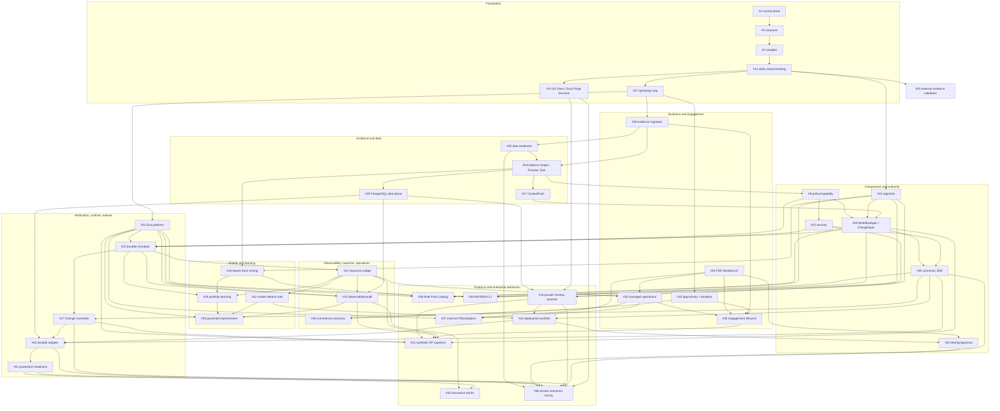

# FDE Issue Dependency DAG

This file is the repository-owned dependency index for unfinished work. It does not replace Issue bodies. It gives Agents a cycle-free starting graph, highlights convergence nodes, and identifies which work may be parallelized.

Canonical procedure authority:

```text
ed3c/skills-shared@ec5a240fa3cbafda2c6a8bce0ae12143e0992f80
```

Skill bodies remain external. The DAG records consumer-specific work only.

## Graph rules

- A **hard edge** means the child consumes an admitted contract or implementation from the parent.
- An **integration edge** means the work can start on its own locked contract but cannot complete its integration gate until the referenced subject exists.
- A **review edge** is read-only and never grants a writer lease.
- A node with several hard parents requires an explicit convergence task/branch. Git Town does not make a branch have several parents by implication.
- Global documentation/procedure gates #14 and #47 precede product implementation but do not serialize every path-disjoint module.
- A branch/PR is created only after its Issue task packet compiles without cycles, lease overlap, or missing interface locks.

## High-level DAG



The Mermaid view intentionally shows the main semantic edges. The table below is the complete direct-dependency index used for task planning.

## Complete direct-dependency index

| Issue | Work unit | Hard start dependencies |
|---:|---|---|
| #1 | Epic / Outcome Delivery OS | - |
| #2 | Repository control plane | #1 |
| #3 | Public contracts | #2 |
| #4 | Role + Overlay compiler | #3 |
| #8 | Evidence Graph + Process Twin | #14, #47, #26, #45, #4 |
| #9 | Policy + Connector Capability Registry | #8, #14 |
| #10 | Durable simulator + Runtime Receipts | #9, #14, #22, #28, #31 |
| #11 | Outcome Ledger + unit economics | #10, #14 |
| #12 | Model registry + release train | #11, #14 |
| #13 | Git Town / Dual Forge live receipts | #1, #14 |
| #14 | External skills-shared binding | #1, #4 |
| #15 | Artifact registries | #14, #4 |
| #16 | Expert-behavior Skill mining | #8, #14, #15 |
| #17 | Release safety + Change Controller | #9, #10, #14, #22, #28, #31, #32 |
| #18 | Human FDE Workbench | #14, #15 |
| #19 | Portfolio learning/productization | #10, #11, #14, #16 |
| #20 | Managed operations | #10, #11, #14, #18 |
| #21 | Synthetic AP capstone | #8, #9, #10, #11, #14, #15, #17, #18, #22, #25, #26, #27, #28, #30, #31, #32, #33, #42, #45 |
| #22 | Security control plane | #9, #14 |
| #23 | External case evidence validation | #14 |
| #25 | Opportunity triage + Outcome Charter | #14, #47 |
| #26 | Evidence ingestion/redaction/disambiguation | #14, #47 |
| #27 | Provenance ContextPack | #8, #14, #26 |
| #28 | WorkflowSpec / ChangeSpec compiler | #8, #9, #14, #15, #27 |
| #29 | PostgreSQL data plane | #8, #14, #15, #22 |
| #30 | Connector SDK + MCP boundary | #9, #14, #22, #28 |
| #31 | Multi-layer Eval platform | #14, #47 |
| #32 | Observability + audit linkage | #10, #11, #14, #22, #29, #31 |
| #33 | Private Tenant Overlay resolver | #13, #14, #15, #22, #29 |
| #34 | Deployment profiles | #12, #14, #22, #29, #30, #33 |
| #35 | Governed improvement/post-training loop | #12, #14, #16, #19, #31, #32 |
| #36 | Commercial outcome contracts | #11, #14, #20, #25 |
| #37 | Internal FDE/adoption | #14, #18, #20, #25, #31 |
| #38 | Role Pack catalog | #14, #15, #16, #28, #31 |
| #39 | Developer API/SDK/CLI | #14, #15, #28, #30, #31 |
| #40 | Durable runtime adapter | #10, #14, #22, #29, #30, #32, #34 |
| #41 | Production readiness/resilience | #14, #20, #22, #29, #30, #31, #32, #40 |
| #42 | Engagement lifecycle | #14, #18, #20, #25, #26, #8, #28, #17, #31, #32 |
| #43 | Assurance evidence packs | #14, #18, #20, #22, #29, #31, #32, #41 |
| #44 | Enterprise identity/approval adapter | #14, #18, #22, #29, #32, #34 |
| #45 | Data-for-Agent readiness | #14, #26, #47 |
| #46 | First private connector canary | #13, #14, #17, #22, #30, #31, #32, #33, #34, #40, #41, #44, #45 |
| #47 | Agent operating map / README Stack index | #14 / PR #24 |

## Convergence nodes

These nodes have several prerequisite subjects and must receive an explicit Tech Lead convergence packet:

| Node | Required convergence |
|---|---|
| #28 WorkflowSpec/ChangeSpec | approved Process Twin + ContextPack + registry + policy/capability contracts |
| #30 Connector SDK | WorkflowSpec action contract + security + policy/capability |
| #10 Durable simulator | WorkflowSpec semantics + policy + security + Eval contract |
| #17 Change Controller | simulator + policy/security + WorkflowSpec/ChangeSpec + Eval + observability contracts |
| #32 Observability | runtime + outcome + persistence + security + Eval identities |
| #40 Durable adapter | simulator + persistence + connector + observability + deployment profile |
| #42 Engagement lifecycle | business, evidence, design, release, operations, and Eval gate contracts |
| #21 AP capstone | complete synthetic vertical slice across business/evidence/design/runtime/outcome |
| #46 Live canary | exact local/private/GitHub, identity, connector, runtime, resilience, and authorization evidence |

A convergence branch does not merge semantic conflicts automatically. It binds exact admitted parent commits, runs integration/mutation gates, and remains Draft until Human admission.

## Parallelizable sibling groups

The following work may start as sibling contract branches after #14 and #47, provided path leases are disjoint:

- #25 opportunity/Outcome Charter contracts;
- #26 ingestion/provenance contracts;
- #31 EvalPack/receipt base contracts;
- #15 registry lifecycle contracts;
- #23 evidence/source ledger;
- documentation or synthetic fixture work that does not alter shared schemas.

Later implementation siblings include:

- provider-neutral model routing (#12) and role catalog content (#38) after their contracts exist;
- Workbench UI surfaces (#18) and developer API surfaces (#39) after backend authority contracts are locked;
- individual Role Packs under #38 after the common catalog contract;
- deployment-profile validators under #34 after the common profile contract.

## Review-only lanes

- Shadow Architecture observes and records deltas; it does not write Builder paths.
- #23 may change architecture only through a new Issue/contract revision; source claims do not directly mutate product code.
- Assurance #43 maps evidence but does not self-certify or promote.
- Human/legal/financial reviewers own waivers, settlement, merge, release, and production.

## Cycle prevention

The Data-for-Agent contract (#45) is upstream of Process Twin (#8). Its core semantic/readiness work therefore depends on #26 and the documentation/procedure gates, **not** on the persistent Process Twin data plane or observability implementation. PostgreSQL (#29) and observability (#32) are downstream adapters/integration consumers. This separation prevents the former `#45 → #29/#32 → #8 → #45` cycle.

Any newly discovered cycle is `DAG_CYCLE` and blocks branch allocation until interfaces are split or the edge is reclassified.
