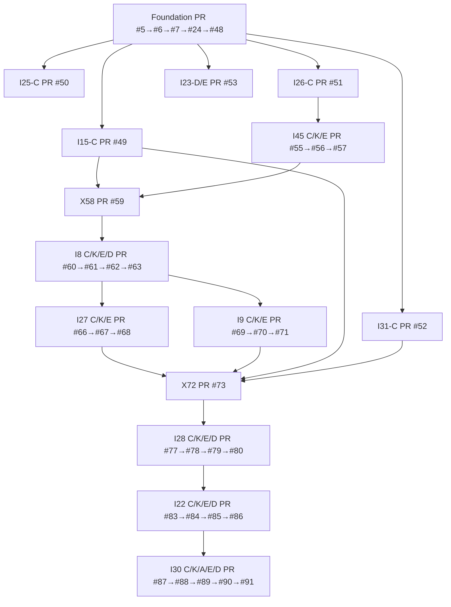
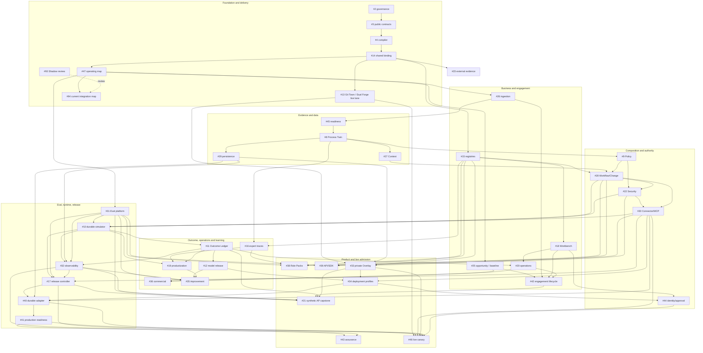

# FDE Issue dependency DAG

This file owns repository-specific dependency classification. Issue bodies own detailed requirements. Exact Git/PR state and runtime receipts own observed facts.

Canonical procedure authority:

```text
ed3c/skills-shared@ec5a240fa3cbafda2c6a8bce0ae12143e0992f80
```

## Edge types

- **start edge** — enough stable interface exists to begin a child contract atom.
- **completion edge** — child cannot claim its integration complete until the parent implementation and Gate are admitted.
- **integration edge** — path-disjoint work may proceed but must meet at an explicit `X` convergence node.
- **review edge** — read-only monitor/evidence relation; never grants a writer lease.
- **live edge** — requires local/private/provider evidence unavailable to a GitHub-only runtime.
- **Human edge** — merge, release, production, legal, financial or organizational admission.

A branch name or a green leaf does not satisfy a completion edge.

## Actual implementation DAG through Stage B4



Admission remains open at #54, #64, #75, #81 and #92.

## Semantic product DAG



## Current Issue status overlay

| Issue group | Current state | Admission/completion note |
|---|---|---|
| #2 #3 #4 #14 #47 | `IMPLEMENTED_DRAFT` | Foundation PRs remain open/unmerged. #94 repairs stale routing docs. |
| #15 #25 #26 #31 | `PARTIAL_CONTRACT` | C atom exists; core/Eval/handoff atoms remain. Gate #54 open. |
| #23 | `PARTIAL_CONTRACT` / external evidence lane | ledger exists; independent artifacts/reproduction absent. |
| #45 | `SYNTHETIC_CLOSED` | C/K/E exist; Gate #64 and live data/persistence remain. |
| #8 | `SYNTHETIC_CLOSED` | C/K/E/D exist; Gate #64 and real Process Owner evidence remain. |
| #27 #9 | `SYNTHETIC_CLOSED` | C/K/E exist; Gate #75 open. |
| #28 | `SYNTHETIC_CLOSED` | C/K/E/D exist; Gate #81 open. |
| #22 #30 | `SYNTHETIC_CLOSED` | Security C/K/E/D and Connector C/K/A/E/D exist; Gate #92 open. |
| #10–#12 #16–#21 #29 #32–#44 #46 | `OPEN_DESIGN` or `BLOCKED_LIVE_SUBSTRATE` | no complete implementation Stack. |
| #13 #33 #44 #46 live portions | `BLOCKED_LIVE_SUBSTRATE` | requires local/private/provider authorization and receipts. |
| #54 #64 #75 #81 #92 | `INTEGRATION_ADMISSION_OPEN` | must not be bypassed by downstream prose. |
| #93 | read-only review | closes after #94 documentation handoff. |
| #94 | documentation implementation | docs-only branch from Stage B4 terminal. |

## Start vs completion dependencies

| Child | May start contract work when | Cannot complete until |
|---|---|---|
| #10 Durable simulator | exact Workflow/Security/Connector/Eval contracts are locked | Gate #92 admitted, executable #31 K/E exists, full convergence tests pass |
| #17 Release Controller | ChangeSpec/WorkflowSpec and runtime/release interfaces are locked | #10, #31, #32 and Gate #92 admitted; replay/Shadow/canary faults pass |
| #11 Outcome Ledger | runtime receipt contract is locked | #10 executable receipts and baseline/measurement sources exist |
| #18 Workbench | Registry/process/approval interfaces are locked | identity, engagement/release/outcome subjects are integrated |
| #21 AP capstone | domain contracts and fixtures may be designed | #10/#11/#17/#18/#31/#32 plus private-reference boundaries converge |
| #29 Persistence | Process Twin/Registry/Security contracts are locked | migrations, tenancy, restore and integration Evals pass |
| #32 Observability | exact receipt identities are locked | persistence/runtime/outcome/Eval subjects exist and correlation tests pass |
| #38 Role Packs | Registry/Workflow common contracts are locked | expert traces, Eval packs and catalog lifecycle converge |
| #39 API/SDK | read/validate/compile contracts are locked | Registry/Workflow/Connector/Eval integration and authority separation pass |
| #46 Live canary | public/private/live contracts are designed | local forge, private resolver, identity, runtime, resilience and Human authorization all exist |

## Admission Gate DAG

```text
#54 Contract Foundation
  ↓
#64 Data Readiness + Process Twin
  ↓
#75 Context + Policy convergence
  ↓
#81 WorkflowSpec / ChangeSpec
  ↓
#92 Security + Connector/MCP
  ↓
future #10/#17/#21 gates
```

A later Draft Stack may exist before an earlier Gate closes, but its evidence remains provisional and exact-parent-bound.

## Convergence nodes

| Node | Required exact convergence |
|---|---|
| #28 | Process Twin + Context + Registry + Policy/Capability + Eval contracts |
| #30 | Workflow action contract + Policy + Security + ConnectorCapability |
| #10 | Workflow semantics + Security/Connector result semantics + executable Eval contract |
| #17 | runtime + ChangeSpec + Security/Connector + Eval + Observability |
| #32 | runtime + persistence + security + Eval + Outcome identities |
| #40 | simulator + persistence + connector + observability + deployment profile |
| #42 | business, evidence, target design, release, operations and Eval gates |
| #21 | full synthetic business/evidence/design/runtime/outcome/Workbench slice |
| #46 | public/private Git, identity, connector, runtime, resilience and authorization evidence |

Convergence never auto-resolves semantic conflict. One writer binds admitted exact subjects and re-runs all required tests/mutations.

## Parallelizable next atoms

After review of exact parent contracts, these are path-disjoint candidates:

```text
I31-K/E/D  executable Eval plane
I15-K/E/D  Registry core
I25-K/E/D  discovery/baseline core
I26-K/E/D  ingestion core
I29-C       persistence contract
```

`I10-C` may be prepared against locked contracts, but `I10-K/E/D` completion remains blocked on executable I31 and Gate #92 admission.

## Review-only and source lanes

- Shadow Architecture issues are read-only and never write Builder paths.
- #23 records source evidence; it cannot mutate product code or promote interview claims.
- #43 maps assurance evidence; it cannot certify compliance.
- Human/legal/financial/security owners retain waivers, settlement, merge, release and production authority.

## Cycle prevention

- #45 semantic/readiness contracts remain upstream of #8.
- #29 persistence and #32 observability are downstream adapters, not prerequisites for defining readiness semantics.
- #31 common Eval contract may start early, but module-specific Evals consume their module subjects.
- #10 runtime consumes Connector results; #30 does not consume #10.
- #17 release consumes runtime; runtime must not depend on release promotion.

Any new cycle is `DAG_CYCLE` and blocks branch allocation until the interface or edge type is corrected.
