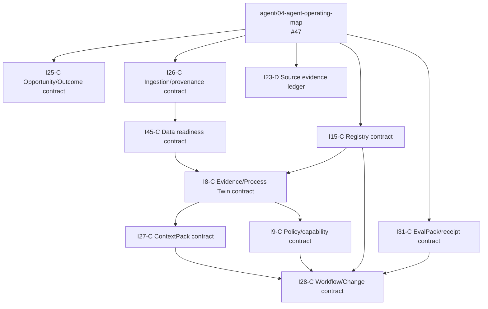

# Git Town Stacked PR and Molecular Implementation Index

This is the consumer-owned branch/PR traceability index. Canonical Git Town and Tech Lead procedures remain in:

```text
ed3c/skills-shared@ec5a240fa3cbafda2c6a8bce0ae12143e0992f80
```

This file records repository-specific issues, branches, parents, path families, and planned terminal atoms. It never proves that Git Town, a linked Worktree, Forgejo, Actions, or a provider ran.

## Evidence vocabulary

- `ACTIVE_DRAFT_PR` — branch and Draft PR exist on GitHub.
- `IMPLEMENTING` — branch exists; implementation/readback is in progress.
- `PLANNED` — Issue/task shape exists; no branch/PR/runtime is implied.
- `BLOCKED_LIVE_RUNTIME` — requires admitted local/private/provider capability.
- `NOT_EXERCISED` — capability may exist elsewhere but has not been proved for this subject.
- `HUMAN_ADMIT_REQUIRED` — merge, release, production, legal, financial, or destructive transition.

## Active governance stack

| Order | Issue | Branch | Exact parent | Draft PR | Current evidence |
|---:|---:|---|---|---:|---|
| 00 | #2 | `agent/00-bootstrap-control-plane` | `main@709abf40242aa3fba7ee971616f1a472532a488a` | #5 | branch/tree + reported local L2 tests |
| 01 | #3 | `agent/01-contracts` | `agent/00-bootstrap-control-plane@0e3024a7ed0505b2fdb02f42fa5008d98be5ea6c` | #6 | branch/tree + reported local L2 tests |
| 02 | #4 | `agent/02-role-overlay-compiler` | `agent/01-contracts@20a5d29a0428b866b040ae8bad3ee9838c09ffcf` | #7 | branch/tree + reported local L2 tests |
| 03 | #14 | `agent/03-shared-procedure-bindings` | `agent/02-role-overlay-compiler@f3c926620e3203d9d6dce0b2e81a9ff8c7e7fd22` | #24 | exact external binding + no-vendoring controls |
| 04 | #47 | `agent/04-agent-operating-map` | `agent/03-shared-procedure-bindings@35be041e250236510211a1afaf900306a5d6ef60` | PENDING | documentation/readback; local gates not yet exercised |

The current connector runtime created the GitHub branch/Issue state. Live Git Town sync/restack, linked Worktrees, Forgejo, Actions, merge, and production remain separate.

## Molecular PR atom contract

Every unfinished Issue is compiled into only the terminal atoms it actually needs:

| Atom | Owns | Must include |
|---|---|---|
| `C` Contract | schema, public type/interface, lifecycle and compatibility lock | fixtures, schema/contract assertions, migration/deprecation rule |
| `K` Core | deterministic product behavior inside one module | unit/negative tests, bounded resources, local README update |
| `A` Adapter | provider, connector, storage, identity, runtime, UI or transport adapter | conformance tests, exact provider/version, degraded/failure states |
| `E` Eval | cross-cutting replay, mutation, fault injection, verifier sensitivity | planted defect killed, exact fixture/evaluator/subject receipt |
| `X` Integration | convergence across admitted parent subjects | exact parent SHAs, E2E/failure tests, no semantic auto-merge |
| `D` Docs/receipt | architecture/operation/runbook/traceability handoff | changed state/DAG/data flow, evidence ceiling, rollback/Human boundary |

Atom IDs are stable as `I<issue>-<atom>`, for example `I28-C`, `I28-K`, `I28-E`.

Default branch pattern:

```text
agent/i<issue>-<atom-lower>-<short-slug>
```

The task compiler may choose a clearer repository-approved slug, but the Issue and atom ID must remain in the task packet and PR body.

### Atom ordering

```text
C → K → A? → E? → X? → D?
```

This is not a requirement to create empty PRs. An atom exists only when it has an independent review surface and oracle. Unit/contract tests are part of `C`, `K`, or `A`; `E` is reserved for cross-cutting mutation/fault/replay work.

### Parent rules

- `C` starts from the exact admitted prerequisite convergence subject.
- `K` consumes `C`.
- provider-specific `A` branches are siblings after a stable adapter contract when path-disjoint.
- `E` consumes the implementation subjects it evaluates and cannot rewrite their assertions.
- `X` is the only allowed multi-parent convergence node; it records all exact parent SHAs.
- `D` normally travels with the atom. A separate terminal `D` PR is used only when documentation/receipt paths are path-disjoint and independently reviewable.

## Logical Stack families

| Family | Purpose | Typical serial spine | Parallel leaves |
|---|---|---|---|
| `FDN` | repository, contracts, shared procedure, Agent docs | #2 → #3 → #4 → #14 → #47 | #13 live delivery lane |
| `ENG` | opportunity, engagement, Human Workbench, adoption | #25 → #42 | #18, #37 after locks |
| `DAT` | ingestion, readiness, Evidence Graph, context, persistence | #26 → #45 → #8 → #27 | #29 persistence adapter after contracts |
| `CMP` | registries and workflow compilation | #15 → convergence #28 | Role Pack pack leaves under #38 |
| `AUT` | policy, security, identity, connector capability | #9 → #22 → convergence #30 | provider adapters, #44 identity |
| `VER` | common Eval contract and layer-specific evaluators | #31 base contract | module-specific Eval siblings |
| `RUN` | simulator, release controller, durable adapter | #10 → #17 → #40 | adapter implementations after common contract |
| `OBS` | observability and assurance | #32 → #43 | exporters as sibling adapters |
| `OUT` | Outcome Ledger, operations, commercial | #11 → #20 → #36 | Workbench presentation paths |
| `LRN` | model release, expert traces, productization, repair | #12 / #16 → #19 → #35 | model/provider adapters |
| `PRD` | Role Packs, developer surface, capstone | #38 / #39 → #21 convergence | one sibling per Role Pack |
| `LIVE` | private lane, deployment, resilience, canary | #13 → #33 → #34 → #40 → #41 → #46 | deployment-profile siblings |

Families are logical planning groups, not long-lived release branches.

## Complete Issue-to-atom index

| Issue | Family | Primary path | Required atom chain | Logical parent/convergence |
|---:|---|---|---|---|
| #1 | EPIC | `—` | `—` | no implementation branch |
| #2 | FDN | `governance` | `K→E→D` | PR #5 / `agent/00-bootstrap-control-plane` |
| #3 | FDN | `contracts` | `C→E→D` | PR #6 / `agent/01-contracts` |
| #4 | FDN | `src/compiler` | `K→E→D` | PR #7 / `agent/02-role-overlay-compiler` |
| #14 | FDN | `docs/governance` | `C→E→D` | PR #24 / `agent/03-shared-procedure-bindings` |
| #47 | FDN | `README/AGENTS/docs` | `D→E` | `agent/04-agent-operating-map`; Draft PR pending |
| #13 | LIVE | `delivery runtime` | `C→A→E→X→D` | #14; local/private-capable runtime |
| #25 | ENG | `src/discovery` | `C→K→E→D` | #14 + #47 |
| #26 | DAT | `src/engagement` | `C→K→E→D` | #14 + #47 |
| #45 | DAT | `src/data` | `C→K→E→D` | #26 + #47 |
| #8 | DAT | `src/evidence` | `C→K→E→D` | #26 + #45 + #4 + #14 + #47 |
| #27 | DAT | `src/context` | `C→K→E→D` | #8 + #26 |
| #29 | DAT | `src/data persistence` | `C→K→A→E→D` | #8 + #15 + #22 |
| #15 | CMP | `src/registry` | `C→K→E→D` | #4 + #14 + #47 |
| #28 | CMP | `src/workflow` | `C→K→E→D` | converge #8 + #9 + #15 + #27 |
| #38 | PRD | `role-packs` | `C→K(pack siblings)→E→X→D` | #15 + #16 + #28 + #31 |
| #9 | AUT | `src/policy` | `C→K→E→D` | #8 + #14 + #47 |
| #22 | AUT | `src/security` | `C→K→E→D` | #9 + #14 |
| #44 | AUT | `src/identity` | `C→K→A→E→D` | #18 + #22 + #29 + #32 + #34 |
| #30 | AUT | `src/connectors` | `C→K→A(adapter siblings)→E→X→D` | converge #9 + #22 + #28 |
| #31 | VER | `evals` | `C→K→E→D` | #14 + #47; extended by module children |
| #10 | RUN | `src/runtime simulator` | `C→K→E→D` | converge #9 + #22 + #28 + #31 |
| #17 | RUN | `src/release` | `C→K→E→X→D` | converge #9 + #10 + #22 + #28 + #31 + #32 |
| #40 | RUN | `src/runtime adapter` | `C→A→E→X→D` | converge #10 + #29 + #30 + #32 + #34 |
| #34 | LIVE | `src/deployment profiles` | `C→K(profile siblings)→E→X→D` | #12 + #22 + #29 + #30 + #33 |
| #41 | LIVE | `production readiness` | `C→K→E→X→D` | #20 + #22 + #29 + #30 + #31 + #32 + #40 |
| #46 | LIVE | `private connector canary` | `C→A→E→X→D` | converge #13 + #17 + #22 + #30–#45 prerequisites |
| #32 | OBS | `src/observability` | `C→K→A→E→D` | #10 + #11 + #22 + #29 + #31 |
| #43 | OBS | `src/assurance` | `C→K→E→D` | #18 + #20 + #22 + #29 + #31 + #32 + #41 |
| #11 | OUT | `src/outcomes` | `C→K→E→D` | #10 + #14 |
| #20 | OUT | `src/operations` | `C→K→E→D` | #10 + #11 + #18 |
| #36 | OUT | `src/outcomes/commercial` | `C→K→E→D` | #11 + #20 + #25 |
| #12 | LRN | `src/models` | `C→K→A→E→D` | #11 + #14 |
| #16 | LRN | `src/learning/expert` | `C→K→E→D` | #8 + #15 |
| #19 | LRN | `src/learning/portfolio` | `C→K→E→D` | #10 + #11 + #16 |
| #35 | LRN | `src/learning/improvement` | `C→K→E→X→D` | #12 + #16 + #19 + #31 + #32 |
| #23 | EVID | `docs/evidence` | `C→E→X→D` | #14 + #47; read-only source lane |
| #18 | ENG | `src/workbench` | `C→K→E→X→D` | #15; integration #8/#11/#17 |
| #37 | ENG | `src/workbench/adoption` | `C→K→E→D` | #18 + #20 + #25 + #31 |
| #42 | ENG | `src/engagement lifecycle` | `C→K→E→X→D` | converge #8 + #17 + #18 + #20 + #25 + #26 + #28 + #31 + #32 |
| #39 | PRD | `src/api` | `C→K→E→X→D` | #15 + #28 + #30 + #31 |
| #21 | PRD | `AP capstone` | `C→K→A→E→X→D` | converge all core dependencies in #21 |

## Planned branch graph after documentation gate

The next serial architecture spine is:

```text
agent/04-agent-operating-map  #47
└─ agent/05-evidence-process-twin  #8
   └─ agent/06-policy-connector-registry  #9
      └─ agent/07-durable-runtime-drift  #10
         └─ agent/08-outcome-ledger  #11
            └─ agent/09-model-release-train  #12
```

That spine is **not yet created** and may be refined into molecular atoms before branch allocation. #26 and #45 must land as admitted prerequisites before #8 implementation; they may be sibling contract stacks from `agent/04-agent-operating-map` and converge into the #8 base. #31 may also begin as a sibling base-contract stack.

## Recommended first fan-out after #47



Each arrow is a consumed contract, not a command to merge automatically.

## Review and restack law

- Each child PR targets its exact parent branch.
- Review the smallest upstream contract first.
- Parent changes invalidate downstream receipts until restack and revalidation.
- `git town sync` success proves only synchronization, never correctness or release readiness.
- Unattended sync is bounded, non-interactive, no-push, and no-auto-resolve.
- Semantic conflicts stop the Worker and require repository/Human admission.
- Independent siblings never cherry-pick each other without a new convergence/selection decision.
- A green leaf does not make the integrated stack green.

## PR traceability fields

Every Draft PR body records:

```text
Issue + atom ID
exact base/head/tree
parent branch and consumed contract digests
path lease/read-only/forbidden paths
changed files
acceptance commands and exits
mutation/fault controls
evidence ceiling
Shadow Architecture checkpoint
Git Town/Forgejo/Actions/publication states
cleanup and rollback identity
Human-owned next transition
```

## Live/private lane

#13, #33, and #46 require a local/private-capable runtime. GitHub connector access cannot prove:

- local Git/Worktree identity;
- Git Town executable/version/checksum;
- Forgejo repository/issues/PRs;
- private Tenant Overlay bytes;
- credentials or customer authorization;
- exact connector/provider execution;
- local-main-first merge;
- GitHub Actions on the exact candidate.

These remain `ABSENT`, `NOT_EXERCISED`, or `HUMAN_ADMIT_REQUIRED` until exact receipts exist.
