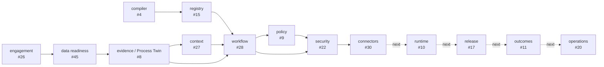

# Product source map

`src/` contains consumer-owned product implementation. Canonical procedures remain in the exact `skills-shared` subject; no Skill body lives here.

Current observed parent:

```text
agent/i30-d-connector-handoff
b24444b7910197c20ff53d12c983a052c82738ab
```

## Source directory DAG



Solid nodes exist on current Draft stacks. Dashed nodes are absent and Issue-owned.

## Current directory inventory

| Path | Existence | Local State Machine | Consumes | Emits | Issue / actual Stack | Completion boundary |
|---|---|---|---|---|---|---|
| `compiler/` | exists | `INPUT_BOUND → CROSS_VALIDATED → NORMALIZED → COMPILED/REJECTED` | RolePack + TenantOverlay | DigitalEmployeeSpec | #4 / PR #7 | `IMPLEMENTED_DRAFT`; no admission/production |
| `registry/` | exists | `DRAFT → VALIDATED → ACTIVE → SUPERSEDED/REVOKED` | artifact identity + validation receipt | RegistryEntry | #15 / PR #49 / Gate #54 | `PARTIAL_CONTRACT`; K/E/D missing |
| `engagement/` | exists | `SOURCE_BOUND → PARSED → REDACTED → CLAIM_CANDIDATE → AMBIGUOUS/HUMAN_REVIEW` | SourceManifest + parser/redaction evidence | claim/entity candidates | #26 / PR #51 / Gate #54 | `PARTIAL_CONTRACT`; ingestion core and adapters missing |
| `data/` | exists | `PROFILED → SEMANTICALLY_BOUND → READY/DEGRADED/BLOCKED` | semantic metric + quality profile | DataReadinessDecision | #45 / PRs #55–#57 / Gate #64 | `SYNTHETIC_CLOSED`; persistence/live data absent |
| `evidence/` | exists | `CLAIMS_BOUND → VIEW_SEPARATED → CONTRADICTIONS_EXPOSED → TWIN/REFUSED` | admitted claims + readiness | EvidenceClaim + ProcessTwin | #8 / PRs #60–#63 / Gate #64 | `SYNTHETIC_CLOSED`; process-owner/live completeness unproved |
| `context/` | exists | `QUERY_BOUND → DEPENDENCY_CLOSURE → MINIMIZED → READY/DEGRADED/REFUSED` | ProcessTwin + claim index + policy subjects | ContextPack | #27 / PRs #66–#68 / Gate #75 | `SYNTHETIC_CLOSED`; production recall unproved |
| `policy/` | exists | `REQUESTED → DENY/APPROVAL_REQUIRED/ALLOW_CANDIDATE` | identity evidence + authority envelope + capability | PolicyDecision | #9 / PRs #69–#71 / Gate #75 | `SYNTHETIC_CLOSED`; live identity/credential absent |
| `workflow/` | exists | `DRAFT → VALIDATED → COMPILED/REFUSED`; `REQUESTED → CANDIDATE → VALIDATED/REFUSED` | Twin + Context + DigitalEmployee + Policy + Capability | WorkflowSpec + ChangeSpec | #28 / PRs #77–#80 / Gate #81 | `SYNTHETIC_CLOSED`; no execution/release authority |
| `security/` | exists | `GRANT_ISSUED → ACTIVE/REVOKED/EXPIRED`; `INVOCATION_REQUESTED → DENY/ALLOW_CANDIDATE`; `AUDIT_GENESIS → APPEND_ONLY_CHAIN` | workflow/policy/capability/grant/endpoint policy | ToolSecurityDecision + SecurityAuditEvent | #22 / PRs #83–#86 / Gate #92 | `SYNTHETIC_CLOSED`; no live grant issuer or host secret |
| `connectors/` | exists | `REQUEST_BOUND → SECURITY_VERIFIED → DISPATCHED → SUCCEEDED/FAILED/RATE_LIMITED/PARTIAL/UNKNOWN_COMPLETION`; `UNKNOWN → RECONCILING → SUCCEEDED/FAILED/FROZEN` | ConnectorRequest + exact security/capability + adapter registry | ConnectorResult + ConnectorReceipt | #30 / PRs #87–#91 / Gate #92 | `SYNTHETIC_CLOSED` for in-memory adapter only |

## Implemented data flow

```text
RolePack + TenantOverlay
→ DigitalEmployeeSpec

SourceManifest
→ EvidenceClaimCandidate
→ DataReadinessDecision
→ EvidenceClaim / ProcessTwin
→ ContextPack

DigitalEmployeeSpec
+ ProcessTwin
+ ContextPack
+ ConnectorCapability
+ PolicyRequest / PolicyDecision
→ WorkflowSpec / ChangeSpec
→ CapabilityGrant / ToolInvocation
→ ToolSecurityDecision
→ ConnectorRequest
→ in-memory synthetic adapter
→ ConnectorResult / ConnectorReceipt
```

Every arrow is exact-subject and candidate-bound. Only the final synthetic adapter mutates state, and only in memory.

## Missing source directories and required first atoms

| Planned path | Required State Machine | First atom | Prerequisites / Issue |
|---|---|---|---|
| `runtime/` | `QUEUED → RUNNING/WAITING → SUCCEEDED/FAILED/TIMED_OUT/UNKNOWN → RECONCILING/COMPENSATING/FROZEN` | `I10-C` | Gate #92 + executable Eval plane; #10 |
| `release/` | `REPLAY → SHADOW → RECOMMEND → DRAFT → CANARY → PROMOTION_CANDIDATE/ROLLBACK/FROZEN` | `I17-C` | #10 + #32; #17 |
| `outcomes/` | `BASELINE → MEASURED → ATTRIBUTION_REVIEW → VERIFIED_CANDIDATE/DISPUTED/REJECTED` | `I11-C` | #10; #11/#36 |
| `models/` | `REGISTERED → OFFLINE_EVAL → SHADOW → CANARY → ACTIVE/ROLLBACK` | `I12-C` | #11; #12 |
| `learning/` | `TRACE_SELECTED → SCRUBBED → ADJUDICATED → REPAIR_CANDIDATE → EVALUATED → ADMITTED/REJECTED` | `I16-C` | #8/#15; #16/#19/#35 |
| `observability/` | `SPAN_OPEN → CORRELATED → REDACTED → SEALED/INCOMPLETE` | `I32-C` | #10/#29/#31; #32 |
| `private-lane/` | `REFERENCE_BOUND → RESOLVED → DIGEST_VERIFIED → USED/REVOKED` | `I33-C` | #13/#15/#22/#29; #33 |
| `deployment/` | `PROFILED → VALIDATED → STAGED → CANARY → ADMITTED/ROLLED_BACK` | `I34-C` | model/connector/private lane; #34/#41/#46 |
| `identity/` | `IDENTIFIED → ROLE_RESOLVED → APPROVAL_BOUND → EXPIRED/REVOKED` | `I44-C` | Workbench/security/persistence; #44 |
| `workbench/` | `REVIEW_REQUIRED → HUMAN_DECISION → SIGNED/REJECTED/EXPIRED` | `I18-C` | Registry + process/outcome interfaces; #18/#37 |
| `operations/` | `ONBOARDING → MANAGED → DEGRADED/FROZEN → RECOVERED/HANDOFF` | `I20-C` | Runtime + Outcome + Workbench; #20 |
| `assurance/` | `CONTROL_MAPPED → EVIDENCE_BOUND → REVIEWED → GAP/READY_FOR_EXTERNAL_REVIEW` | `I43-C` | Observability/resilience; #43 |
| `api/` | `REQUEST → VALIDATE → READ/COMPILE/PROPOSE → RECEIPT` | `I39-C` | Registry/workflow/connector/Eval; #39 |
| `discovery/` | `CANDIDATE → SCORED → BASELINED → PILOT_PLANNED/REJECTED` | `I25-K` after existing `I25-C` | #25 / Gate #54 |

A missing directory must not be pre-created. Its first atom must include the local README, locked interface, fixtures/tests, path lease, and evidence ceiling.

## Local directory contract

Every source directory README must contain:

1. owning Issue and current Gate;
2. exact input and output subjects;
3. local State Machine;
4. dependency and authority boundaries;
5. degraded/failure states;
6. current molecular PR Stack;
7. exact verification commands and evidence ceiling;
8. downstream consumers;
9. cleanup and rollback identity.

## Cross-module laws

- Dependencies cross directories through public typed contracts, never hidden shared mutable state.
- A downstream module may narrow authority but cannot widen an upstream Role, Policy, Security, or Connector ceiling.
- Evidence and context remain non-authorizing.
- Policy and Security `ALLOW` remain candidates until the exact Connector request is admitted.
- MCP descriptors contain no endpoint, grant, credential, callback, transaction, or execution authority.
- Side-effect retries require operation identity and idempotency; unknown completion requires observation/reconciliation.
- Natural language never becomes executable code or a direct production mutation.
- Product provider code stays behind typed adapters with exact version and failure semantics.
- Customer/private bytes stay in the private lane.

## Current downstream frontier

```text
complete I31-K/E/D
→ I10-C/K/E/D
→ I17-C/K/E/X/D
→ I11-C/K/E/D
→ I18 / I42
→ I21-C/K/A/E/X/D
```

Parallel completion stacks:

```text
I15-K/E/D
I25-K/E/D
I26-K/E/D
I29-C/K/A/E/D
I32-C/K/A/E/D
```

The actual PR and Gate graph is indexed in `../docs/governance/stack-index.md`.
